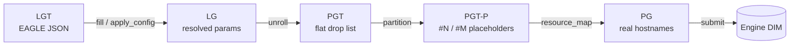

# DALiuGE Translator — Architecture

Status: as-built description of `daliuge-translator` at the time of writing. Written as
the reference baseline for the translator rewrite.

Scope: **the translator only**. The engine (`daliuge-engine`), the graph editor (EAGLE)
and the deployment tooling are treated as external parties, described only where they
define a contract the translator must honour.

---

## 1. What the translator is

The translator is a **pure graph-to-graph compiler**. It takes a *Logical Graph* — a
human-authored, parameterised, hierarchical workflow description produced by EAGLE — and
lowers it into a *Physical Graph*: a flat, fully-instantiated list of DROP specifications
annotated with the node and island each DROP will run on.

It holds no execution state, owns no data, and never runs a workflow. Its outputs are JSON
documents. Everything it does is a deterministic function of (graph, parameters, resource
list), with two exceptions noted in §9.

```
      EAGLE                    TRANSLATOR                         ENGINE
   ┌──────────┐   LGT   ┌──────────────────────────┐    PG    ┌──────────────┐
   │  editor  │ ──────► │ fill → unroll →          │ ───────► │ DIM / NM     │
   └──────────┘         │ partition → map          │          │ (deployment) │
                        └──────────────────────────┘          └──────────────┘
```

---

## 2. The artefact chain

Five artefacts, four transitions. Every stage boundary is a JSON document, which is why
each stage is separately addressable from both the CLI and the REST API.

| # | Artefact | Shape | Produced by |
|---|----------|-------|-------------|
| 1 | **LGT** — Logical Graph Template | EAGLE JSON: `nodeDataArray`, `linkDataArray`, `modelData`, optional `graphConfigurations` | EAGLE |
| 2 | **LG** — Logical Graph | Same shape, parameters resolved, config applied | `fill` / `fill-config` |
| 3 | **PGT** — Physical Graph Template | Flat `list[dropdict]` + trailing reprodata element | `unroll` |
| 4 | **PGT-P** — Partitioned PGT | Same list; each DROP carries `node: "#N"`, `island: "#M"` placeholders | `partition` |
| 5 | **PG** — Physical Graph | Same list; placeholders replaced by real hostnames | `map` |



The stage boundary that matters most: **`unroll` is where hierarchy dies.** Before it,
the graph is a nested structure of constructs with a degree of parallelism. After it, the
graph is a flat DAG. Everything downstream (partitioning, scheduling, mapping) operates on
the flat DAG and knows nothing about Scatters or Loops.

---

## 3. Module map

```
dlg/
├── translator/
│   └── tool_commands.py       CLI surface; registers the `dlg translator …` command group
└── dropmake/                  everything else — the actual compiler
    ├── pg_generator.py        public API / stage orchestration  (fill, unroll, partition, resource_map)
    ├── dm_utils.py            LG loading, version detection, construct normalisation
    ├── graph_config.py        graph configuration overlay onto LG fields
    ├── lg.py                  LG class — unrolling engine
    ├── lg_node.py             LGNode class — per-node semantics, DoP, DROP construction
    ├── definition_classes.py  Categories / ConstructTypes vocabulary
    ├── pgt.py                 PGT base class — DAG, GOJS export, pg_spec export
    ├── pgtp.py                PGT subclasses, one per partitioning algorithm
    ├── scheduler.py           partitioning/scheduling algorithms + DAGUtil
    ├── pg_manager.py          in-process PGT cache for the web UI
    ├── utils/                 antichains, simulated annealing, HEFT, bash param expansion
    ├── lib/                   bundled libmetis.{so,dylib}
    └── web/
        ├── translator_rest.py FastAPI app — REST + HTML UI
        ├── translator_utils.py path/repo helpers, param marshalling
        └── *.html, src/       GOJS/D3 graph viewer assets
```

Rough weight (LOC): `scheduler.py` 1261, `translator_rest.py` 1247, `dm_utils.py` 1030,
`lg_node.py` 1025, `lg.py` 825, `pgtp.py` 665, `tool_commands.py` 638, `pgt.py` 495.

---

## 4. Stage 1 — Load, configure, normalise

Entry: `LG.__init__` in [dlg/dropmake/lg.py:67](dlg/dropmake/lg.py#L67).

1. **Load** — `load_lg` accepts a path, a file-like object, or an already-parsed dict.
2. **Version detect** — `get_lg_ver_type` returns one of `LG_VER_OLD`, `LG_VER_EAGLE_CONVERTED`,
   `LG_VER_EAGLE`, `LG_APPREF`. Detection is heuristic: it prefers
   `modelData.schemaVersion`, then falls back to sniffing the first ≤6 nodes for a `fields`
   array, then to inspecting link port names. Unknown versions raise `GraphException` —
   deliberate, so a future EAGLE schema bump fails loudly rather than silently mistranslating.
3. **Apply active configuration** — `apply_active_configuration`
   ([graph_config.py:68](dlg/dropmake/graph_config.py#L68)) overlays the graph's selected
   `graphConfigurations` entry onto node field *values*. Failures here degrade to warnings
   and the base field values, they do not abort.
4. **Normalise** — version-dependent chain in `dm_utils`:
   - `extract_globals` — hoist graph-level globals into node fields
   - `convert_fields` — lift the `fields` array into flat node attributes
   - `convert_construct` — **the key rewrite.** Each Scatter/Gather/Service construct is
     replaced by a *real application DROP* carrying the construct's input-application
     spec; the construct node itself is reassigned a fresh UUID and children are re-parented
     to it. A Gather with an internal output additionally gets a duplicated app node to
     break the cycle that would otherwise make the result non-DAG.
   - `convert_subgraphs` — split SubGraph constructs into construct/app pairs

   The exact chain is version-dependent: `LG_VER_EAGLE` runs all four,
   `LG_VER_EAGLE_CONVERTED` runs only `convert_construct`, `LG_APPREF` runs only
   `convert_fields`. Note that `convert_mkn` / `convert_mkn_all_share_m`
   ([dm_utils.py:170](dlg/dropmake/dm_utils.py#L170)) are defined but called from nowhere in
   the repository — MKN normalisation is currently dead code despite `Categories.MKN` and
   `ConstructTypes.MKN` still existing.

After normalisation the graph is a uniform node/link array where constructs are ordinary
nodes with a `dop`, and the two class hierarchies collapse to: **group nodes** (have
children, have a DoP) and **leaf nodes** (become exactly one DROP per instance).

### Parameter filling

`fill` ([pg_generator.py:57](dlg/dropmake/pg_generator.py#L57)) is textual, not structural:
the LG is serialised to a string and run through `string.Template` with `~` as the
delimiter (`_LGTemplate`), so `~param.name` placeholders anywhere in the JSON get
substituted. Nested parameter dicts are flattened to dotted keys first. This is the
deprecated path — `fill-config`/`graph_config` is the supported mechanism.

---

## 5. Stage 2 — Unroll (LG → PGT)

The heart of the translator. Two phases, both in [lg.py](dlg/dropmake/lg.py).

### 5.1 Node expansion — `lgn_to_pgn`

Recursive walk from `self._start_list` (nodes with no inputs). For each node:

- **Group node** → iterate `range(lgn.dop)`, recursing into children with an extended
  instance id `iid = "{parent_iid}-{i}"`. Scatter and Loop produce no DROP of their own;
  GroupBy and Gather do.
- **Loop** → before descending, artificial links are synthesised from each group-end node
  back to each group-start node, forming the iteration circle.
- **Non-Scatter group** → artificial links are synthesised from the construct to its
  "first" children (those with no inputs, or those flagged group-start).
- **MPI node** → one DROP per process rank.
- **Leaf** → exactly one DROP via `make_single_drop`.

`iid` is the hierarchical coordinate of an instance (`"0-3-1"` = outer scatter index 0,
inner scatter 3, innermost 1). It is the *only* mechanism connecting a physical DROP back
to its logical position, and it is a string that later code splits on `-` and `$`.
Multi-key GroupBy encodes an unravelled multi-dimensional index after a `$`.

**Degree of parallelism** (`LGNode.dop`, [lg_node.py:612](dlg/dropmake/lg_node.py#L612))
is computed per construct type: Scatter reads `num_of_copies`/`num_of_splits`
(defaulting to 4 if absent — a wart), Loop reads `num_of_iter`, Gather derives
`ceil(input_dop / gather_width)`, GroupBy derives from its scatter layers, MPI reads
`num_of_procs`, everything else is 1.

### 5.2 Link resolution — `unroll_to_tpl`

Walks `self._lg_links` and, for each logical link, decides how the N source DROPs connect
to the M target DROPs. The decision tree is driven by group membership and *h-level*
(hierarchy depth):

| src / tgt | Behaviour |
|-----------|-----------|
| group → non-group | artificial within-group link; requires `len(sdrops) == len(tdrops)` |
| Gather → group-start | sequentialisation of a high-DoP Scatter via the gather cache |
| group → group | GroupBy → Gather only |
| non-group → non-group | chunked distribution by `dop_diff`, with special cases for loop-end→loop-start relinking, cross-loop stepwise locking, and `loop_aware` links (first/last iteration only) |
| non-group → GroupBy | DROPs bucketed by group key derived from `iid`; key count must equal DROP count |
| non-group → Gather | chunked by `gather_width` |

Link creation itself is `_link_drops`. Three distinct wiring styles:

1. **Streaming app→app** — a `NullDROP` is injected between them and the consumer is
   registered as a *streaming* consumer.
2. **App/Control source** — port names are resolved from `outputPorts`/`inputPorts` and a
   `port_map` is recorded on the target DROP.
3. **Data source** — direct consumer/input wiring, streaming or not depending on the
   link's `is_stream` flag (set during `__init__` if the source port name ends in `stream`).

**Gather cache.** Gathers cannot be wired eagerly, because the gather's own inputs and
outputs are discovered at different points of the walk. `self._gather_cache` accumulates
`{gather_oid: [drop, inputs, outputs, link]}` and is drained at the end of `unroll_to_tpl`.

### 5.3 Cleanup and output

Before returning, `unroll_to_tpl` deletes the DROPs that were only scaffolding: start
nodes, listener sub-drops, GroupBy `grp-data_drop` handles, all Gather DROPs, and SubGraph
construct DROPs. What remains is flattened from `self._drop_dict` into a single list.

`pg_generator.unroll` then optionally zeroes `sleep_time` (`zerorun`) or swaps every
application's `dropclass` for a stand-in (`app=…`, used for dry runs), and appends the
graph's reprodata as the final list element.

### 5.4 Validation

`LG.validate_link` runs during `__init__` and enforces the structural rules: Scatter and
Loop constructs cannot be linked directly; Gather output must be a group-start Component
at the same h-level as the Gather's input; GroupBy input must not be a group and must be
unique and scatter-enclosed; GroupBy output must be a Gather; source and target must be
hierarchically related, unless both sit in Loops of equal DoP. Violations raise
`GInvalidLink`. This is the only real static-analysis pass in the translator, and it runs
before any DROP exists.

---

## 6. Stage 3 — Partition (PGT → PGT-P)

`pg_generator.partition` ([pg_generator.py:131](dlg/dropmake/pg_generator.py#L131)) selects
a PGT subclass by algorithm name and hands over.

```
PGT (pgt.py)                       — no partitioning; builds the DAG, exports GOJS/pg_spec
├── MetisPGTP        "metis"       — k-way / recursive-bisection via the METIS library
├── MySarkarPGTP     "mysarkar"    — list scheduling, edge-zeroing (Sarkar variant)
│   ├── MinNumPartsPGTP  "min_num_parts" — as above, minimising partition count under a deadline
│   └── PSOPGTP          "pso"           — particle-swarm search over partition assignments
```

`"none"` maps to the base `PGT` — DAG built, nothing partitioned.

**The DAG.** `DAGUtil.build_dag_from_drops` ([scheduler.py:1164](dlg/dropmake/scheduler.py#L1164))
converts the flat DROP list into a `networkx.DiGraph` with integer keys, node weight =
predicted execution time, edge weight = predicted data movement. All algorithms operate on
this DAG, never on the DROP list directly. METIS is the exception in that it needs an
*undirected* graph, so `MetisPGTP.to_partition_input` emits both directions.

**Scheduling layer.** [scheduler.py](dlg/dropmake/scheduler.py) is the algorithm library
underneath the PGTP classes:

- `Schedule` — a DAG + max-DoP, exposing makespan, longest path, schedule matrix, efficiency
- `Partition` / `KFamilyPartition` — a partition with a DoP ceiling, supporting
  `can_add` / `add` / `merge` with antichain-based DoP probing
- `MySarkarScheduler`, `MinNumPartsScheduler`, `PSOScheduler` — the three in-house algorithms
- `DAGUtil` — longest path, max width, max DoP, max antichains, topological labelling,
  Gantt matrix, METIS import, DAG construction

Supporting maths lives in [utils/](dlg/dropmake/utils/): `antichains.py` (max weighted
antichain via a min-cut formulation), `anneal.py` (simulated annealing), `heft/base.py`
(HEFT list scheduling).

**Islands.** After partitioning, `to_pg_spec` ([pgt.py:219](dlg/dropmake/pgt.py#L219))
optionally merges partitions into *data islands* (`num_islands > 1`) or down to the
available node count. It then stamps each DROP with `node` and `island`. With
`tpl_nodes_len` set — the normal path from `pg_generator.partition` — the values written
are placeholders `#0`, `#1`, … rather than hostnames, producing a *pg_spec template*
deployable to a cluster whose node names are not yet known (e.g. SLURM).

**GOJS export.** `to_gojs_json` serves the web viewer. It is not a pure serialiser: when
`_extra_drops` is unset it *mutates the graph*, inserting synthetic `BarrierAppDROP` /
`InMemoryDROP` nodes wherever two same-type DROPs are directly adjacent, so the viewer can
render a strictly alternating data/app graph. Because `pg_generator.partition` always calls
it, those synthetic DROPs are present in the production path too.

---

## 7. Stage 4 — Map (PGT-P → PG)

`resource_map` ([pg_generator.py:244](dlg/dropmake/pg_generator.py#L244)) is trivial by
design: split the node list into the first `num_islands` entries (island managers) and the
rest (node managers), then rewrite every `#N` placeholder into the corresponding hostname.
Nothing about the graph structure changes. This is the only stage that knows anything about
real infrastructure.

---

## 8. Entry points

### CLI

Registered via the `dlg.tool_commands` setuptools entry point
([setup.py:171](setup.py#L171)) → `register_commands`
([dlg/translator/tool_commands.py:603](dlg/translator/tool_commands.py#L603)):

| Command | Action |
|---------|--------|
| `dlg translator unroll` | LG → PGT |
| `dlg translator partition` | PGT → PGT-P |
| `dlg translator unroll-and-partition` | both, one pass |
| `dlg translator map` | PGT-P → PG (queries the DIM for the node list if `--nodes` is absent) |
| `dlg translator submit` | POST a PG to a Drop Manager |
| `dlg translator fill-config` | apply a graph configuration |
| `dlg translator fill` | **deprecated** textual parameter substitution |
| `dlg translator tm` | run the web server |

Every command reads stdin/a path and writes stdout/a path, so the stages compose in a
shell pipeline. The `submit` path is the only one that reaches outside the process, via
`CompositeManagerClient`.

### REST / web

[web/translator_rest.py](dlg/dropmake/web/translator_rest.py) is a FastAPI app serving two
deliberately separate API generations:

- **`Original`** — the legacy `lg_web` endpoints (`/jsonbody`, `/gen_pgt`, `/gen_pg`,
  `/gen_pg_spec`, `/gen_pg_helm`, `/pg_viewer`, `/show_gantt_chart`, …), query/form-parameter
  driven, HTML-returning, kept for backwards compatibility.
- **`Updated`** — `/lg_fill`, `/unroll`, `/partition`, `/unroll_and_partition`, `/map`.
  Body-parameter driven JSON endpoints mirroring the CLI one-for-one.

Incoming graphs are validated against `dlg/dropmake/lg.graph.schema` via `jsonschema`.
`PGManager` ([pg_manager.py](dlg/dropmake/pg_manager.py)) caches generated PGTs in memory
so the viewer, Gantt chart and schedule-matrix endpoints can re-fetch by id. Two module-level
semaphores (`post_sem`, `gen_pgt_sem`) serialise the mutating endpoints — a direct
consequence of §9's thread-safety note.

The server also bundles the graph viewer front-end (GOJS/D3/ECharts assets under `web/src`).

---

## 9. Cross-cutting concerns

**Identity.** Every DROP gets an `oid` built from the session id (`ssid`, defaulting to an
ISO timestamp) plus the logical node id plus the `iid`. The session id doubles as the
`oid_prefix` CLI option, which is how callers make OIDs deterministic across runs.

**Reproducibility.** Not owned by the translator — it lives in
`dlg.common.reproducibility` (daliuge-common) and is *called at each stage boundary*:
`init_lgt_repro_data`, `init_lg_repro_data`, `init_pgt_unroll_repro_data`,
`init_pgt_partition_repro_data`, `init_pg_repro_data`. The convention is that reprodata
travels as the **final element of the artefact list**, which is why nearly every stage
transition contains a `repro = pgt.pop()` … `pgt.append(repro)` dance. Getting this wrong
silently corrupts the graph, because the reprodata element is otherwise shaped like a DROP.

**Exceptions.** All derive from `GraphException` (`dm_utils`): `GInvalidLink`,
`GInvalidNode` for structural problems; `GPGTException`, `GPGTNoNeedMergeException`
(`pgt.py`) for partitioning; `SchedulerException` (`scheduler.py`);
`GraphConfigException` family (`graph_config.py`).

**Thread safety.** `LG.unroll_to_tpl` is explicitly documented as not thread-safe. The web
layer compensates with semaphores rather than the translator being made safe.

**Determinism.** Deterministic apart from (a) the default `ssid` timestamp when no
`oid_prefix` is supplied, and (b) `PSOPGTP`, which is a stochastic search.

**Dependencies.** `daliuge-common` (for `dropdict`, `CategoryType`, reproducibility,
constants, clients), `networkx`, `numpy`, `metis` + bundled `libmetis`, `pyswarm`,
`fastapi`/`uvicorn`/`jinja2`, `jsonschema`. Note the translator does **not** depend on
`daliuge-engine`.

---

## 10. Architectural observations for the rewrite

Recorded as-is; these are the load-bearing weaknesses, not a redesign proposal.

1. **`LG.__init__` is the whole front end.** Loading, version detection, config application,
   four normalisation passes, node construction, link construction and validation all happen
   in a constructor. There is no way to obtain a parsed LG without also running normalisation
   and validation. The class docstring already flags this.

2. **`iid` is a stringly-typed coordinate.** Instance identity is a `-`/`$`-delimited string
   parsed by `split()` in at least three places (`lgn_to_pgn`, GroupBy key derivation,
   loop context). Any change to construct nesting semantics means string-format archaeology.

3. **Construct semantics are spread across three layers.** `Categories` string constants,
   `LGNode.is_*` predicates, and the `if/elif` chains in `lgn_to_pgn` / `unroll_to_tpl` /
   `_link_drops` each encode part of what a Scatter or Gather means. Adding a construct
   requires touching all three. `definition_classes.py` carries a TODO saying the explicit
   Category treatment should disappear in favour of CategoryType.

4. **`unroll_to_tpl`'s link resolution is one ~250-line nested conditional.** The
   src-group/tgt-group/h-level/loop-aware matrix is implicit in nesting order, not stated
   anywhere. This is the single highest-risk region for behaviour drift during a rewrite.

5. **Gather is wired out-of-band.** The gather cache exists because the walk order does not
   match the wiring order. Any rewrite that establishes a proper two-pass structure
   (resolve all instances, then resolve all edges) removes the need for it.

6. **`to_gojs_json` mutates.** A visualisation function inserting DROPs into the production
   graph is a boundary violation, and it fires on the normal partition path.

7. **Reprodata-as-last-list-element.** An untyped positional convention across four stage
   boundaries and both entry points. A typed envelope (`{"drops": [...], "reprodata": {...}}`)
   would eliminate a whole class of pop/append bugs — at the cost of a wire-format change
   the engine must agree to.

8. **Two REST API generations in one 1247-line module.** The `Original`/`Updated` split is
   documented but not physically separated, and the legacy half mixes HTML rendering with
   translation logic.

9. **Silent defaults.** Scatter DoP falls back to 4 when no count field is found
   ([lg_node.py:629](dlg/dropmake/lg_node.py#L629), marked "dummy impl"); missing
   `categoryType` on a Gather input is defaulted to `"Data"` mid-validation. Both turn
   authoring errors into wrong-but-plausible graphs.

10. **METIS is a mixed dependency.** `MetisPGTP` sets `self._metis_path = "gpmetis"`
    (an external binary on `$PATH`) while `DAGUtil.import_metis()` loads the Python binding
    against the bundled `lib/libmetis.so`. The binary path appears vestigial but is not
    obviously dead.

---

## 11. Contracts a rewrite must preserve

Anything below is observable by a party outside the translator, so changing it is a
cross-repository decision, not a translator-local one.

- **PG wire format** — the flat `list[dropdict]` with `oid`, `categoryType`, `dropclass`,
  `node`, `island`, `inputs`/`outputs`/`consumers`/`producers`/`streamingConsumers`,
  `port_map`, `rank`, `iid`. Consumed directly by the engine's Drop Managers.
- **Reprodata as the trailing list element** at every stage boundary.
- **`#N` / `#M` placeholder convention** in pg_spec templates — deferred deployment
  (SLURM, Helm) depends on it.
- **CLI command names, options and stdin/stdout piping behaviour** — used by deployment
  scripts across the project.
- **REST endpoint paths and payload shapes** for both API generations — EAGLE calls the
  `Original` endpoints.
- **`lg.graph.schema`** — the accepted LG input contract shared with EAGLE.
- **Supported LG version types** — `LG_VER_EAGLE`, `LG_VER_EAGLE_CONVERTED`, `LG_APPREF`.
- **Partitioning algorithm names** — `none`, `metis`, `mysarkar`, `min_num_parts`, `pso`,
  and their `algo_params` keys (`min_goal`, `ptype`, `max_load_imb`, `max_cpu`, `max_mem`,
  `time_greedy`, `deadline`, `topk`, `swarm_size`).

---

## 12. Test surface

| Area | Tests |
|------|-------|
| Logical graph / unrolling | `test/dropmake/test_lg.py`, `test_lg_fill.py` |
| Normalisation utilities | `test/dropmake/test_dm_utils.py` |
| Graph configuration | `test/dropmake/test_graph_config.py` |
| PGT generation & partitioning | `test/dropmake/test_pg_gen.py`, `test_scheduler.py` |
| Web / translator manager | `test/dropmake/test_tm.py` |
| CLI | `test/test_tool_trans.py` |
| Reproducibility integration | `test/reproducibility/` (largest single test area, ~4000 LOC) |

Test graphs come from the external `eagle-test-graphs` package, pinned in `setup.py`'s
`test` extra. That pin is the de-facto regression corpus: a rewrite is behaviour-compatible
to the extent it reproduces the PGTs those graphs currently produce.
