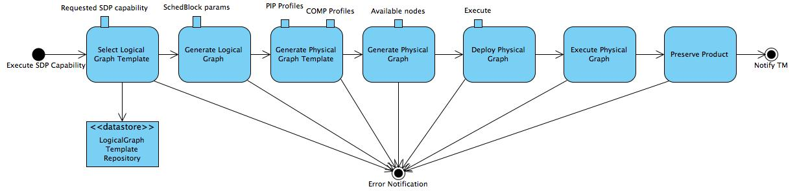

Concepts and Background
-----------------------

This section briefly introduces key concepts and motivations underpinning
|daliuge|.

Dataflow
^^^^^^^^
A traditional dataflow computation model does not explicitly place any control or
constraints on the order or timing of operations beyond what is inherent in the
data dependencies among compute tasks. The removal of explicit scheduling of
compute task in the dataflow model has opened up new (e.g. parallelism)
opportunities that are previously masked by "artificial" control flow imposed by
applications or programmers. A similar example is the ``make`` tool, where the
programmer focuses on defining each target and its dependencies. The burden of
exploring parallelism to efficiently execute many individual compiling tasks in
a correct order lies within the responsibility of the ``make`` utility.

Graph
^^^^^
Following the dataflow model, a computer program can be described by a Directed
Graph where the nodes denote compute task, and the edges denote data dependencies
between operations.  In principle, a dataflow graph consists of edges,
nodes (or actors), and tokens. Tokens represent data items and travel across
directed edges to be transformed at nodes into other data items (similar to
functions). While in theory the dataflow model provides a powerful yet simple
formalism to describe parallel computation, early efforts in developing
`dataflow architecture <http://ieeexplore.ieee.org/stamp/stamp.jsp?arnumber=48862>`_
had to introduce control flow operators (e.g.  switch and merge) and data
storage mechanism in order to put dataflow models into practice.

.. _dataflow.datadriven:

Data-driven
^^^^^^^^^^^
In developing |daliuge|, we have extended the "traditional" dataflow
model by integrating data lifecycle management, graph execution engine, and
cost-optimal resource allocation into a coherent data-driven framework.
Concretely, we have made the following changes to the existing dataflow model:

* Unlike traditional dataflow models that characterise data as "tokens" moving
  across directed edges between nodes, we instead model data as the node,
  elevating them as actors who have autonomy to manage their own lifecycles and
  trigger appropriate "consumer" applications based on their own internal
  (persistent) states. In our graph model, both application (task) and data nodes
  are termed as **Drops**. What are really moving on the edge are
  :ref:`Drop Events <drop.events>`.

* While nodes/actors in the traditional dataflow are stateless functions, we
  express both computation and data nodes as stateful Drops. Statefulness not only
  allows us to manage Drops through persistent checkpointing, versioning and recovery
  after restart, etc., but also enables data sharing amongst multiple processing
  pipelines in situations like re-processing or commensal observations.
  All the state information is kept in the Drop wrapper, while the payload of the
  Drops, i.e. pipeline component algorithms and data, are stateless.

* We introduced a small number of control flow graph nodes at the logical level
  such as *Scatter*, *Gather*, *GroupBy*, *Loop*, etc. These additional control
  nodes allow pipeline developers to systematically express complex data
  partitioning and event flow patterns based on various requirements and science
  processing goals. More importantly, we transform these control nodes into
  ordinary Drops at the physical level. Thus they are nearly transparent to the
  underlying graph/dataflow execution engine, which focuses solely on exploring
  parallelisms orthogonal to these control nodes placed by applications. In this
  way, the Data-Driven framework enjoys the best from both worlds - expressivity
  at the application level and flexibility at the dataflow system level.

* Finally, we differentiate between two kinds of dataflow graphs - **Logical Graph** and
  **Physical Graph**. While the former provides a higher level of
  abstraction in a resource-independent manner, the latter represents the actual
  execution plan consisting of inter-connected Drops mapped onto a given set of
  hardware resources in order to meet performance requirements at minimum cost
  (e.g. power consumption). In addition we further distinguish between **Logical Graph Templates**
  and **Logical Graphs** and **Physical Graph Templates** and **Physical Graphs**.
  The template graph in each of the pairs has a number of free parameters, while in the actual
  graph everything is fully defined. The free parameters of a **Logical Graph Template** allow
  changes to the configuration and behaviour of components, but none of those will change the
  structure and logic of the **Logical Graph**. Similarly free parameters in **Physical Graph Templates** will
  allow allocation of parts of the graph to certain hardware resources to produce the final **Physical Graph**.
  The structure of the template is the same as the structure of any **Physical Graph** derived from the same
  template. Note however that, while changing some of the parameters of a **Logical Graph Template** will not change
  the structure of the derived **Logical Graph** at all, it can dramatically change the structure of the 
  associated **Physical Graph Template** and **Physical Graph**. For example a scatter construct in a **Logical Graph Template** has 
  exactly the same strcuture for 2 and for 100,000 splits, but the **Physical Graph** will show either 2 or 100,000 branches.

.. _dlg_functions:

|daliuge| Functions
^^^^^^^^^^^^^^^^^^^
|daliuge| provides eight Graph-based functions as shown in
:numref:`dataflow.fig.funcs`.

.. _dataflow.fig.funcs:

   Graph-based Functions of the |daliuge| Prototype

The :doc:`graphs` section will go through implementation details for each function.
Here we briefly discuss how they work together in our data-driven framework.

* First of all, the *Logical Graph Template* (topleft in
  :numref:`dataflow.fig.funcs`) represents high-level
  data processing capabilities. In the case of SDP, they could be, for example,
  "Process Visibility Data" or "Stage Data Products".

* Logical Graph Templates are managed by *LogicalGraph Template
  Repositories* (bottomleft in :numref:`dataflow.fig.funcs`).
  The logical graph template is first selected from this repository for a specific pipeline and
  is then filled with scheduling block parameters. This generates a *Logical Graph*, expressing a workflow with resource-oblivious dataflow constructs.

* Using profiling information of pipeline components executed on specific hardware resources, |daliuge|
  then "translates" a Logical Graph into a *Physical Graph Template*, which prescribes a manifest of all Drops without specifying their physical locations.

* Once the information on resource availability (e.g. compute node, storage, etc.) is presented,
  |daliuge| associates each Drop in the physical graph template with an available resource unit
  in order to meet pre-defined requirements such as performance, cost, etc.
  Doing so essentially transforms the physical graph template into a *Physical Graph*,
  consisting of inter-connected Drops mapped onto a given set of resources.

* All four graph varieties are serializable as JSON strings, that is also how graphs are stored in repositories and transferred.

* Before an observation starts, the |daliuge| engine de-serializes a physical graph JSON string and turns all the nodes into Drop objects and then deploys all the Drops onto the allocated resources as per the
  location information stated in the physical graph. The deployment process is
  facilitated through :doc:`managers`, which are daemon processes managing the deployment of Drops
  onto the designated resources. Note that the :doc:`managers` do _not_ control the Drops or the execution, but they do monitor the state of them during the execution.

* Once an observation starts, the graph :ref:`graph.execution` cascades down the graph edges through either data Drops that triggers its next consumers or application Drops
  that produces its next outputs. When all Drops are in the **COMPLETED** state, some data Drops
  are persistently preserved as Science Products by using an explicit persist
  consumer, which very likely will be specifically dedicated to a certain
  science data product.
