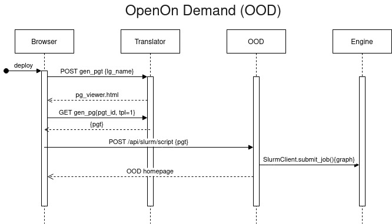
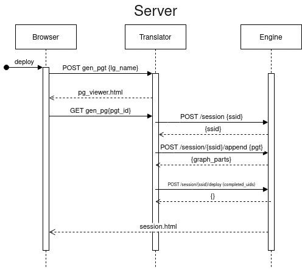
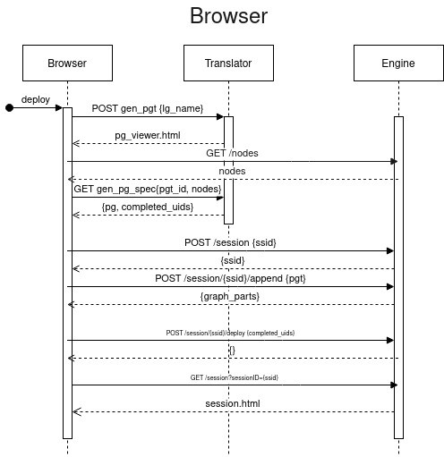
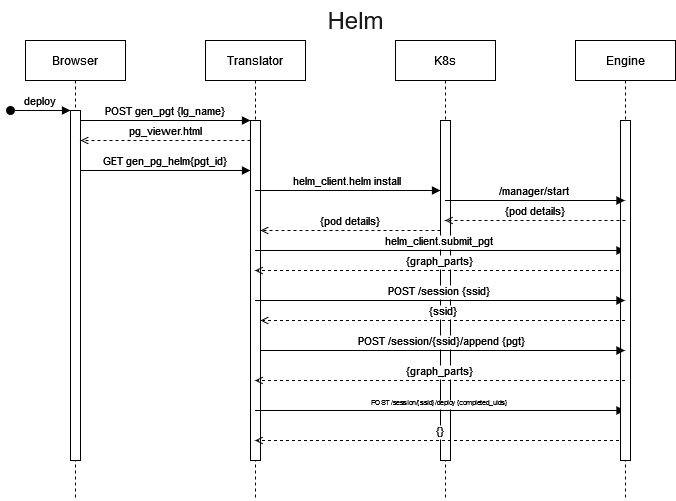

.. _deployment:

.. _dlg_functions:

Operational Concepts
^^^^^^^^^^^^^^^^^^^^
As mentioned above, |daliuge| has been developed to enable processing of data from the future Square Kilometre Array (SKA) observatory. To support the SKA operational environment |daliuge| provides eight Graph-based functions as shown in
:numref:`dataflow.fig.funcs`. The implementation of these operational concepts in general does not restrict the usage of |daliuge| for other use cases, but it is still taylored to meet the SKA requirements.

.. _dataflow.fig.funcs:

.. figure:: ../images/dfms_func_as_graphs.jpg

   Graph-based Functions of the |daliuge| Prototype

The :doc:`../architecture/graphs` section describes the implementation details for each function.
Here we briefly discuss how they work together to fullfill the SKA requirements.

* First of all, the *Logical Graph Template* (topleft in
  :numref:`dataflow.fig.funcs`) represents high-level
  data processing capabilities. In the case of the SKA Data Processor, they could be, for example,
  "Process Visibility Data" or "Stage Data Products".

* Logical Graph Templates are managed by *LogicalGraph Template
  Repositories* (bottomleft in :numref:`dataflow.fig.funcs`).
  The logical graph template is first selected from this repository for a specific pipeline and
  is then populated with parameters derived from the detailed description of the scheduled science observation. This generates a *Logical Graph*, expressing a workflow with resource-oblivious dataflow constructs.

* Using profiling information of pipeline components executed on specific hardware resources, |daliuge|
  then "translates" a Logical Graph into a *Physical Graph Template*, which prescribes a manifest of all Drops without specifying their physical locations.

* Once the information on resource availability (e.g. compute node, storage, etc.) is presented,
  |daliuge| associates each Drop in the physical graph template with an available resource unit
  in order to meet pre-defined requirements such as performance, cost, etc.
  Doing so essentially transforms the physical graph template into a *Physical Graph*,
  consisting of inter-connected Drops mapped onto a given set of resources.

* All four graph varieties are serializable as JSON strings, that is also how graphs are stored in repositories and transferred.

* Before an observation starts, the |daliuge| engine de-serializes a physical graph JSON string and turns all the nodes into Drop objects and then deploys all the Drops onto the allocated resources as per the
  location information stated in the physical graph. The deployment process is
  facilitated through :doc:`../architecture/managers`, which are daemon processes managing the deployment of Drops
  onto the designated resources. Note that the :doc:`../architecture/managers` do _not_ control the Drops or the execution, but they do monitor the state of them during the execution.

* Once an observation starts, the graph :ref:`graph.execution` cascades down the graph edges through either data Drops that triggers its next consumers or application Drops
  that produces its next outputs. When all Drops are in the **COMPLETED** state, some data Drops
  are persistently preserved as Science Products by using an explicit persist
  consumer, which very likely will be specifically dedicated to a certain
  science data product.

Deployment Scenarios
====================

The three components described in the :ref:`intro` section allow for a very flexible deployment. In a real world deployment there will always be one data island manager, zero or one master managers, and as many node managers as there are computing nodes available to the |daliuge| execution engine. In very small deployments one node manager can take over the role of the master manager as well. For extremely large deployments |daliuge| supports a hierarchy of island managers to be deployed, although even with 10s of millions of tasks we have not seen the actual need to do this. Note that the managers are only deploying the graph, the execution is completely asynchronous and does not require any of the higher level managers to run. Even the *manager functionality* of the node manager is not required at run-time.

The primary usage scenario for the |daliuge| execution engine is to run it on a large cluster of machines with very large workflows of thousands to millions of individual tasks. However, for testing and small scale applications it is also possible to deploy the whole system on a single laptop or on a small cluster. It is also possible to deploy the whole system or parts of it on AWS or a Kubernetes cluster. For instance EAGLE and/or the *translator* could run locally, or on a single AWS instance and submit the physical graph to a master manager on some HPC system. This flexible deployment is also the reason why the individual components are kept well separated.

The translator is able to determine which of the following options is available given the selected deployment endpoint.

Deployment in HPC Centers
~~~~~~~~~~~~~~~~~~~~~~~~~

For current deployment in HPC systems that do not support OOD, please refer to :ref:`slurm_deployment`. 

When trying to deploy |daliuge| inside a HPC centre the basic concept as described above does not apply, since in general it is not possible to have the managers running on nodes in a daemon-like way. Typically a user has to submit a job into a batch queue system like SLURM or Torque and that is pretty much all that can be done by a normal user. In order to address this use case, the |daliuge| code base contains example code (daliuge-engine/dlg/deploy/pawsey/start_dfms_cluster.py) which essentially allows to submit not just the workflow, but also the |daliuge| engine as a job. The first thing that job is then doing is to start the managers and then submit the graph. It also allows to start a proxy server, which provides access to the managers' web interfaces via an external machine in order to be able to monitor the running graph. The best way to get access to the |daliuge| code base is to ask the support team to create a load module specifically for |daliuge|. If that is not possible, then users can just load an appropriate Python version (3.7 or 3.8) and install |daliuge| locally. In many cases it is not possible to run docker containers on HPC infrastructure.

.. toctree::
  :maxdepth: 1 
  
  slurm_deployment

Deployment with OpenOnDemand
~~~~~~~~~~~~~~~~~~~~~~~~~~~~

`OpenOnDemand <https://openondemand.org>`_ (OOD) is a system providing an interactive interface to remote compute resources. It is becoming increasingly popular with a number of HPC centers around the world. The two Australian research HPC centers Pawsey and NCI are planning to roll it out for their users. Independently we had realized that |daliuge| is missing a authentication, authorization and session management system and started looking into OOD as a solution for this. After a short evaluation we have started integrating OOD into the deployment for our small in-house compute cluster. In order to make this work we needed to implement an additional interface between the translator running on an external server (e.g. AWS) and OOD and then further on into the (SLURM) batch job system. This interface code is currently in a separate private git repository, but will be released as soon as we have finished testing it. The code mimics the |daliuge| data island manager's REST interface, but instead of launching the workflow directly it prepares a SLURM job submission script and places it into the queue. Users can then use the standard OOD web-pages to monitor the jobs and get access to the logs and results of the workflow execution. OOD allows the integration of multiple compute resources, including Kubernetes and also (to a certain degree) GCP, AWS and Azure. Once configured, users can choose to submit their jobs to any of those. Our OOD interface code has been implemented as an OOD embedded `Phusion Passenger <https://www.phusionpassenger.com/>`_ `Flask <https://flask.palletsprojects.com/en/2.0.x/>`_ application, which is `WSGI <https://wsgi.readthedocs.io>`_ compliant. Very little inside that application is OOD specific and can thus be easily ported to other deployment scenarios.

:numref:`deployment.fig.ood` describes the actions taken by DALiuGE elements when submitting a graph through open on demand.
Importantly, the physical graph deployment is triggered by the user's browser directly, not the machine hosting the translator.

.. _deployment.fig.ood:

   Sequence diagram of graph deployment in OOD envrionment.

Direct Deployment
~~~~~~~~~~~~~~~~~

It is of course possible to submit graphs to |daliuge| managers without additional runtime environments.
The manager and translator components can be docker images or raw processes.
We currently support two methods for submitting graphs in this scenario.

Server
------

The server deployment option assumes the machine hosting the translator can communicate with the manager machines freely.
:numref:`deployment.fig.server` presents a sequence diagram outlining the communication between the different components in this case.

.. _deployment.fig.server:

   Sequence diagram of direct graph deployment.

Browser
-------

Browser-based deployment is useful in the case where only a user's machine can communicate with engine instances but the translator cannot (as is often the case with an externally hosted translator process).
The browser in this case drives execution and submits the graph directly to the manager nodes.
:numref:`deployment.fig.browser` presents a sequence diagram outlining the communication between the different components in this case.
Conceptually this is similar to how the OpenOnDemand deployment works, but targeting direct graph deployment rather than slurm job submission.

N.B. Cross-Origin Resource Sharing (CORS) may return some interesting responses. If running all machines
locally, make sure that your host descriptions in EAGLE and the translator are 'localhost'.

.. _deployment.fig.browser:

   Sequence diagram of restful graph deployment.

Deployment with Kubernetes/Helm (Experimental)
~~~~~~~~~~~~~~~~~~~~~~~~~~~~~~~~~~~~~~~~~~~~~~

Kubernetes is a canonical container orchestration system.
We are building support to deploy workflows as helm charts which will enable easier and more reliably deployments across more computing facilities.
Multi-node kubernetes clusters are now supported to get started see `start_helm_cluster.py <https://github.com/ICRAR/daliuge/blob/master/daliuge-engine/dlg/deploy/start_helm_cluster.py>`_ for an example usage.
Your environment will need have `kubectl` properly configured to point to your desired cluster.
See `daliuge-k8s/README.md <https://github.com/ICRAR/daliuge/tree/master/daliuge-k8s>`_ for a more detailed setup guide.

:numref:`deployment.fig.helm` describes the actions taken by DALiuGE elements when submitting a graph through helm.
Importantly, there is (currently) no return to the browser indicating success or failure of the submission or job.
The user will need to monitor the k8s environment directly.

.. _deployment.fig.helm:

   Sequence diagram of graph deployment in helm environment.

Component Deployment
====================

Docker components
~~~~~~~~~~~~~~~~~

|daliuge| is a workflow development and management system and a workflow execution framework. Workflows rely on components and algorithmic code to perform the actual data reduction. The |daliuge| system does include only a few basic components, everything else needs to be provided and made available to the system externally. The JSON based component descriptions are being used by EAGLE and the translator, the engine needs access to the actual executable code. The most straight forward way to give the |daliuge| engine access to code is to refer to docker images. The engine will pull the images, if not available already and execute them internally as containers. This works even if the |daliuge| managers are launched as docker containers themselfes. Currently we are only supporting docker containers as workflow components. We have tested running the managers as Singularity containers and they internally can still launch docker containers. |daliuge| allows a quite flexible configuration of docker components and the way they are executed. However, there are still a number of restrictions:

  (1) Memory Data Components can't be used directly as input or output of Docker components.

  (2) Care has to be taken when using files to exchange data between docker components and other components. In particular any usage of absolute path names is quite tricky to get working and requires cross-mounting of additional volumes. Although this is possible it is not recommended. The |daliuge| workspace directory is mounted by default in the container components as well.

  (3) By default the docker containers are started with the same user/group ids as the user running the engine.

Note that it is not recommended to pack big external packages together with |daliuge| in a single image. We are using the `slimtoolkit <https://github.com/slimtoolkit/slim>`_ to minimize the size of our docker images and recommend doing this for component images as well.

Python components
~~~~~~~~~~~~~~~~~

Components written in Python provide direct access to the whole |daliuge| engine runtime. They can use direct remote procedure calls and memory sharing even across multiple compute nodes. By default the engine is configured to use the multiprocessing module to launch the *application code* of the components using a maximum number of processes equal to the number of physical cores available on the computer. If there are more components than cores, then they are executed in serial. More advanced Python components, which are not restricted by the Python Global Interpreter Lock (GIL) don't really need this mechanism. Memory data components will automatically switch to use shared memory blocks between those processes. Note that the *component code* will still run in a single process together with the node manager. In the future, in order to minimize side effects, we might entirely switch to using separate processes for the execution of application code.

In order to be able to use Python components, it must be possible for the engine to import the code and thus it must be accessible on the PYTHONPATH at runtime. By default the engine is configured to add the directory $DLG_ROOT/code to the PYTHONPATH and thus users can install their code there using a command like:

.. code-block:: none

  docker exec -ti daliuge-engine bash -c "pip install --prefix=\$DLG_ROOT/code dlg_example_cmpts" 

Please note that the '\' character is required for this to work correctly. In the case of running |daliuge| in docker containers $DLG_ROOT is mounted from the host and thus also the subdirectory code is visible directly on the host. In a typical HPC deployment scenario that directory will be on the user's home directory, or a shared volume, visible to all compute nodes. 

