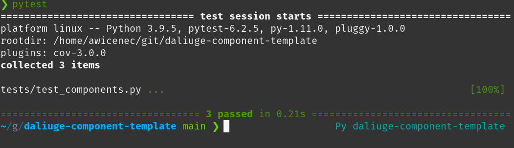

.. default-domain:: py

.. _python_components:

Python Components
=================
Change to the sub-directory ``my_components`` and open the file ``app_components.py``:

.. _graphs.figs.tmpl_app:
.. figure:: ../../images/tmpl_app_components.png

You will need to modify quite a bit of this file in order to produce a complete template. However, we've tried to make this as easy as possible. The file has three main parts:

#. Generic module level in-line documentation
#. Import section: This will bind the component to the |daliuge| system.
#. Doxygen/Sphinx formatted component documentation: This will be used to generate JSON files compatible with EAGLE and will thus enable people to use you components in the visual graph editor.
#. The actual functionality of a standard Python component is contained in the class MyAppDROP. That in turn inherits from the |daliuge| class BarrierAppDROP.

This base class defines all methods and attributes that derived class need to function correctly. This new class will need a single method called ``run <dlg.drop.InputFiredAppDROP.run>``,that receives no arguments (except ``self``), and executes the logic of the application.

Basic development method
------------------------
Since the code already implements a sort of a Hello World example we will simply modify that a bit to see how the development would typically work. In the spirit of test driven development, we will first change the associated test slightly and then adjust the component code accordingly to make the tests pass again. First let's see whether the existing tests pass:

.. _graphs.figs.tmpl_test:

All good! Now change to the tests directory and load the file ``test_components.py``:

.. _graphs.figs.tmpl_test_py:
.. figure:: ../../images/tmpl_test_py.png

and replace the string ``MyAppDROP`` with ``MyFirstAppDROP`` everywhere. There are three occurances, thus this can be done manually. Save the file and execute the test again.\:

.. _graphs.figs.tmpl_test_py_error:
.. figure:: ../../images/tmpl_test_py_error.png

Alright, that looks pretty serious (as expected)! It actually states that it failed in the file ``__init__.py``, thus let's fix this by replacing ``MyAppDROP`` with ``MyFirstAppDROP`` there and run pytest again:

.. _graphs.figs.tmpl_test_py_error2:
.. figure:: ../../images/tmpl_test_py_error2.png

Oops, that still fails! This time in the actual `appComponents.py`` file. Let's do the same replace there and run pytest again:

.. _graphs.figs.tmpl_test_py_fixed:
.. figure:: ../../images/tmpl_test_py_fixed.png

GREAT! In exactly the same manner you can work along to change the functionality of your component and always keep the tests up-to-date.

