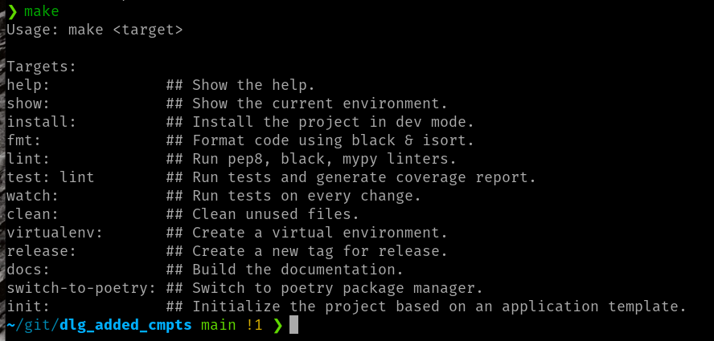

.. default-domain:: py

.. _python_components:

Python Components
=================
We strongly recommend to use the `component development template <https://github.com/ICRAR/daliuge-component-template>`_ we are providing, please refer to chapter :doc:`../template_primer` for more details. The following is based on the usage of the template.

Change to the sub-directory ``dlg_added_cmpts`` and open the file ``apps.py``:

.. _graphs.figs.tmpl_app:
.. figure:: ../../images/tmpl_app_components.png

You will need to modify quite a bit of this file in order to produce a complete application. However, we've tried to make this as easy as possible. The file has three main parts:

#. Generic module level in-line documentation
#. Import section: This will bind the component to the |daliuge| system.
#. Doxygen/Sphinx formatted component documentation: This will be used to generate JSON files compatible with EAGLE and will thus enable people to use your components in the visual graph editor.
#. The actual functionality of a standard Python component is contained in the class MyAppDROP. That in turn inherits from the |daliuge| class BarrierAppDROP.

This base class defines all methods and attributes that derived class need to function correctly. This new class will need a single method called ``run <dlg.drop.InputFiredAppDROP.run>``,that receives no arguments (except ``self``), and executes the logic of the application.

Basic development method
------------------------
Since the code already implements a sort of a Hello World example we will simply modify that a bit to see how the development would typically work. In the spirit of test driven development, we will first change the associated test slightly and then adjust the component code accordingly to make the tests pass again. First let's see whether the existing tests pass:

.. code-block:: none

  make test

There will be quite a few lines passing by, but the last bit gives a good summary:

.. _graphs.figs.tmpl_test:
.. figure:: ../../images/proj_test_initial.png

All tests are passing and code coverage in 100%! When you scroll up and look what actually had been done, you will discover that the Makefile has executed flake8, black, mypy, pytest and coverage. Those tools pretty much make sure that the code is in a healthy state and well formatted. In particular black is really helpful, since it actually allows to automatically format the code according to the Python coding standards. When executing ``make test`` it is only checking, but there is also a ``make fmt``, which actually performs the re-formatting.

Development workflow
--------------------

Let's have a closer look at what is available in the Makefile. Just execute ``make`` without any argument:

.. _graphs.figs.make_output:

Most of the items are pretty self-explanatory and we have already used three of them. In general you won't really need to use the last two ``switch-to-poetry`` and ``init``. You have used ``make virtualenv`` and ``make install`` already, thus it is not likely or required to use those again. The main ones used in the development workflow are ``make test``, ``make fmt``, ``make lint``, ``make clean``, ``make docs`` and ``make release``. The first three are the ones you will use the most the last ones less often, mostly when getting a release ready. ``make watch`` might be useful in some situations. You can also use the normal git commands, e.g. ``git commit`` and ``git push/pull`` independently to keep the local and remote repos up-tp-date and in sync.

Now change to the tests directory and load the file ``test_components.py``:

.. _graphs.figs.tmpl_test_py:
.. figure:: ../../images/tmpl_test_py.png

and replace the string ``MyAppDROP`` with ``MyFirstAppDROP`` everywhere. Save the file and execute the test again.\:

.. _graphs.figs.tmpl_test_py_error:
.. figure:: ../../images/tmpl_test_py_error.png

Alright, that looks pretty serious (as expected)! It actually states that it failed in the file ``__init__.py``, thus let's fix this by replacing ``MyAppDROP`` with ``MyFirstAppDROP`` there and run pytest again:

.. _graphs.figs.tmpl_test_py_error2:
.. figure:: ../../images/tmpl_test_py_error2.png

Oops, that still fails! This time in the actual `appComponents.py`` file. Let's do the same replace in that file and run pytest again:

.. _graphs.figs.tmpl_test_py_fixed:
.. figure:: ../../images/tmpl_test_py_fixed.png

GREAT! In exactly the same manner you can work along to change the functionality of your component and always keep the tests up-to-date.

Obviously you can add more than one component class to the file ``apps.py``, or add multiple files to the directory. Just don't forget to update the file ``__init__.py`` accordingly as well.

Add your documentation
----------------------
It is always good practice to keep the documentation of your components up-to-date and that starts with the README.md file. Open that file and put a proper description about your components into that file. This is what is visible on the GitHub landing page for your project. Make sure the LICENSE file contains a license you (and your employer) are happy with. If you had to install any additional Python packages, make sure they are listed in the ``requriements-test.txt`` and ``requirements.txt`` files and modify the file ``setup.py`` as required. Finally add more detailed documentation to the docs directory. This will then also be published on readthedocs whenever you push to the main branch. After that you will have a pretty nice and presentable component package already.

I/O from input and output ports
-------------------------------
TODO!

Using parameters
----------------
Your application might take some parameters to configure its behavior or provide additional information to the algorithm. Since the end-user of your component will want to specify the values of these parameters through the EAGLE editor there are a few tricks required to enable that. For you as the developer of a component this is pretty much invisible, but you need to use the API. |daliuge| is currently offering six types of parameters:

#.  dlg_string_param
#.  dlg_int_param
#.  dlg_float_param
#.  dlg_bool_param
#.  dlg_list_param
#.  dlg_dict_param

For example to define a greeting parameter for a HelloWorld application you can use a line like

.. code-block:: python

    greet = dlg_string_param("greet", "World")

in the global block of your application class.

