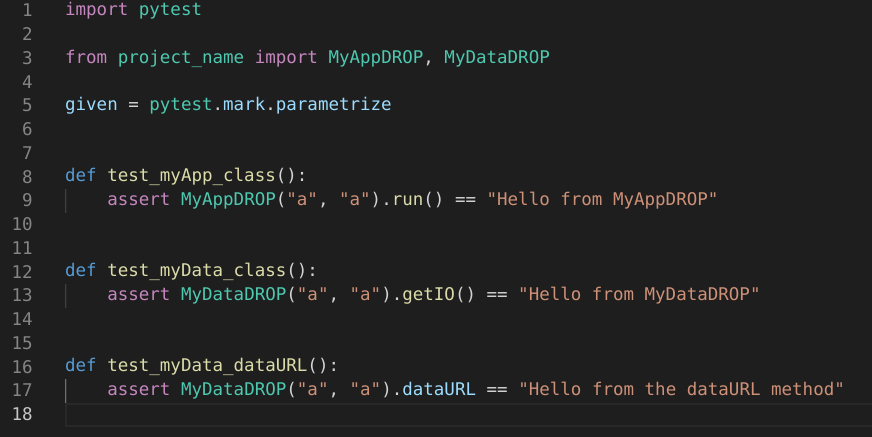
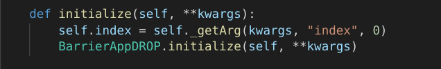

.. default-domain:: py

.. _python_components:

DALiuGEApp Components
=====================
We strongly recommend to use the `component development template <https://github.com/ICRAR/daliuge-component-template>`_ we are providing, please refer to chapter :ref:`template_primer` for more details. The following is based on the usage of the template.

Change to the sub-directory ``my_components`` and open the file ``app_components.py``:

.. _graphs.figs.tmpl_app:

You will need to modify quite a bit of this file in order to produce a complete template. However, we've tried to make this as easy as possible. The file has three main parts:

#. Generic module level in-line documentation
#. Import section: This will bind the component to the |daliuge| system.
#. Doxygen/Sphinx formatted component documentation: This will be used to generate JSON files compatible with EAGLE and will thus enable people to use your components in the visual graph editor.
#. The actual functionality of a standard Python component is contained in the class MyAppDROP. That in turn inherits from the |daliuge| class BarrierAppDROP.

This base class defines all methods and attributes that derived class need to function correctly. This new class will need a single method called ``run <dlg.drop.InputFiredAppDROP.run>``,that receives no arguments (except ``self``), and executes the logic of the application.

Basic development method
------------------------
Since the code already implements a sort of a Hello World example we will simply modify that a bit to see how the development would typically work. In the spirit of test driven development, we will first change the associated test slightly and then adjust the component code accordingly to make the tests pass again. First let's see whether the existing tests pass:

.. _graphs.figs.tmpl_test:

All tests are passing and code coverage in 100%! When you scroll up and look what actually had been done, you will discover that the Makefile has executed flake8, black, mypy, pytest and coverage. Those tools pretty much make sure that the code is in a healthy state and well formatted. In particular black is really helpful, since it actually allows to automatically format the code according to the Python coding standards. When executing ``make test`` it is only checking, but there is also a ``make fmt``, which actually performs the re-formatting.

Test Driven Development workflow
--------------------------------

All good! Now change to the tests directory and load the file ``test_components.py``:

.. _graphs.figs.tmpl_test_py:

and replace the string ``MyAppDROP`` with ``MyFirstAppDROP`` everywhere. Save the file and execute the test again.\:

.. _graphs.figs.tmpl_test_py_error:
.. figure:: ../../images/tmpl_test_py_error.png

Alright, that looks pretty serious (as expected)! It actually states that it failed in the file ``__init__.py``, thus let's fix this by replacing ``MyAppDROP`` with ``MyFirstAppDROP`` there and run pytest again:

.. _graphs.figs.tmpl_test_py_error2:
.. figure:: ../../images/tmpl_test_py_error2.png

Oops, that still fails! This time in the actual ``appComponents.py`` file. Let's do the same replace in that file and run pytest again:

.. _graphs.figs.tmpl_test_py_fixed:

GREAT! In exactly the same manner you can work along to change the functionality of your component and always keep the tests up-to-date.

Obviously you can add more than one component class to the file ``app_components.py``, or add multiple files to the directory. Just don't forget to update the file ``__init__.py`` accordingly as well.

Remove boilerplate and add your documentation
---------------------------------------------
Next step is to clean up the mess from the boylerplate template and update the documentation of our new |daliuge| component. The first thing is to remove the files `ABOUT_THIS_TEMPLATE.md` and `CONTRIBUTING.md`. The next step is to update the file `README.md`. Open that file and remove everything above ``<!--  DELETE THE LINES ABOVE THIS AND WRITE YOUR PROJECT README BELOW -->`` and then do exactly what is written on that line: *Write your project README below!*. Then save the file. Make sure the LICENSE file contains a license you (and your employer) are happy with. If you had to install any additional Python packages, make sure they are listed in the ``requriements-test.txt`` and ``requirements.txt`` files and modify the file ``setup.py`` as required. Finally add more detailed documentation to the docs directory. This will then also be published on readthedocs whenever you push to the main branch. After that you will have a pretty nice and presentable component package already.

Adding Parameters and App Arguments
-----------------------------------
Typically workflows require some user configuration in addition to data. |daliuge| supports this in the form of parameters and/or app arguments and the end user of your component will be able to populate the values for such components in EAGLE during the development of the workflows. In order to make this happen you will need to declare the parameters through the component interface and also document them appropriately so that EAGLE can provide the parameters in the component palette to the end user. Since the end-users of your component will want to specify the values of these parameters through the EAGLE editor there are a few tricks required to enable that. For you as the developer of a component this is pretty much invisible, but you need to use the API. |daliuge| is currently offering six types of parameters:

#.  dlg_string_param
#.  dlg_int_param
#.  dlg_float_param
#.  dlg_bool_param
#.  dlg_enum_param
#.  dlg_list_param
#.  dlg_dict_param

For example to define a greeting parameter for a HelloWorld application you can use a line like

.. code-block:: python

    greet = dlg_int_param("index", 0)

as a member of the custom component class. At runtime the param will be passed on through the graph to the component and converted to the string type after class initialization. Another example is shown below, if you have a parameter called ``index`` you can get the value from the graph at run time by adding a single line to your ``initialize`` method:

.. _graphs.figs.tmpl_params1.png:

you should always do that before calling the initialize of the base class, in the example the ``BarrierAppDROP`` class and add an appropriate variable to the object (``self.index``) such that all other methods will have access to the index parameter's value. Then you should also add a line to the doxygen in-line documentation like this:

.. _graphs.figs.tmpl_params2:

see chapter :doc:`eagle_app_integration` for more details on the syntax. When you now checkin your code to the github repo a github action will generate the palette (JSON description of your components) automatically and you can load it into EAGLE to construct a workflow.

Adding Input and Output Ports
-----------------------------
Ports are how runtime data and information move in and out of your component. Ports are always connected to data components and provide the application component with a homogeneous I/O interface. App components can write whatever data you want to an output port, but be aware that other components, maybe not developed by yourself, will need a compatible reader to interpret the data. In the same spirit you might not be responsible for what is presented to your component on the input ports, but you certainly need to be able to read and use that information.  See chapter :doc:`datadrop_io` for more details.

The first step to make sure this will fit in a workflow, is to document your own inputs and outputs and check the data on the inputs for compliance with what you are expecting. |daliuge|, or more precisely EAGLE is using that information to guide the users developing a workflow and by default allows connections only between matching ports. Again this is based on the doxygen description of your components ports, which look like this:

.. _graphs.figs.tmpl_ports1:

again the details for the syntax are described in the chapter :doc:`eagle_app_integration`. Acessing and using the ports in your component follows always the same pattern and it might be good to separate the reading and writing part out into explicit class methods, although that is not stricly required:

.. _graphs.figs.tmpl_ports2:

In the example above the component is expecting some JSON compatible string on a single input port and it will write some JSON in a pickled format to all of its outputs. It is not required to use pickle, but it helps in a distributed environment. The input port does expect a plain string, not a pickled string in this particular case.

Your ``run`` method could look very simple and essentially always the same, but that depends on the details and complexity of the component itself. Remember that the ``run`` method is the only required method in a component and the only one actually called during run-time directly. The |daliuge| engine is instantiating the component and calls run, when it is triggered.

.. _graphs.figs.tmpl_ports3:

Consider Granularity and Parallelism
------------------------------------
You can put very complex and even complete applications inside a component, but this limits code reusability and daliuge only provides scheduling and deployment parallelism down to the component level. In fact components should perform quite limited tasks, which should in general be useful for other, ideally many workflows. There is always a trade-off between overhead and functionality as well. Although the template makes the development of components quite easy, it still is an overhead, compared to just adding a few lines of code in some existing component. One of the driving requirements to write a new component might thus be whether the functionality of the new component is generic enough to be useful. There might also be other ways of implementing that same functionality and thus there might be a choice of components providing that.

The other, really important consideration is parallelism. In general you should never do that inside a component, but leave that to the developer of the workflow itself. |daliuge| is mainly about distributing and optimizing the distribution of such parallel tasks (instances of components). You should aim to give the |daliuge| engine as many degrees of freedom as possible to deploy the final workflow on the available platform. When developing a component you won't know in what kind of workflows it is going to be used, nor will you know how big and complex those workflows are. Thus, don't assume anything and implement just the functionality to deal with a single, atomic entity of the data the component has to deal with. That also makes the implementation easier and much more straight forward.
