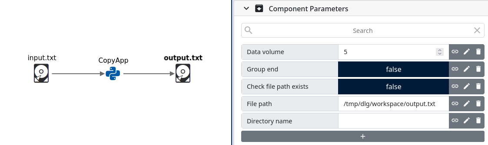

.. _filesystem_components:

Filesystem Components
=====================

Path Based Drop
---------------

:class:`PathBasedDrop <dlg.data.drops.data_base.PathBasedDrop>` is an interface for retreiving the path for drops that are backed by a
filesystem such as local filesystem, NFS or MPFS. Many libraries either have or only have support for reading and writing
with a filesystem path.

File Drop
---------

:class:`FileDROP <dlg.data.drops.file.FileDROP>` is a highly compatible data drop type that can be easily used as persistent volume I/O
and inspection of individual app component I/O. The downside of using file drops is reduced I/O performance compared to
alternative memory based drops that can instead utilize buffer protocol.

Environment variables can be used in the the file path location using the '$' literal, e.g. '$DLG_ROOT' evaluates to '/home/username/dlg'

Directory Drop
-------------------------------------

:class:`DirectoryDROP <dlg.data.drops.directory.DirectoryDROP>`

Container Drop (Legacy)
---------------------------

:class:`ContainerDROP <dlg.data.drops.container.ContainerDROP>`

Using Filesystem Components as Persistent Volume Storage
--------------------------------------------------------

Filesystem component paths are relative to the temporary DALiuGE workspace but may also be of absolute path to the
the machine running DALiuGE engine of connected app drops, most commonly the default DALiuGE shared filesystem mount location
'/tmp/dlg/workspace` located on both the host machine and daliuge engine virtual machine.

In the following example graph, both the input.txt file drop and output.txt file drop paths point to a persistent absolute location
in the workspace folder. On successful graph execution, the output location will be updated.

Depending on DALiuGE settings, the relative workflow path will also be generated and made persistent. Setting the output path to a relative
location will populate a new workflow directory with output after every successful execution.

