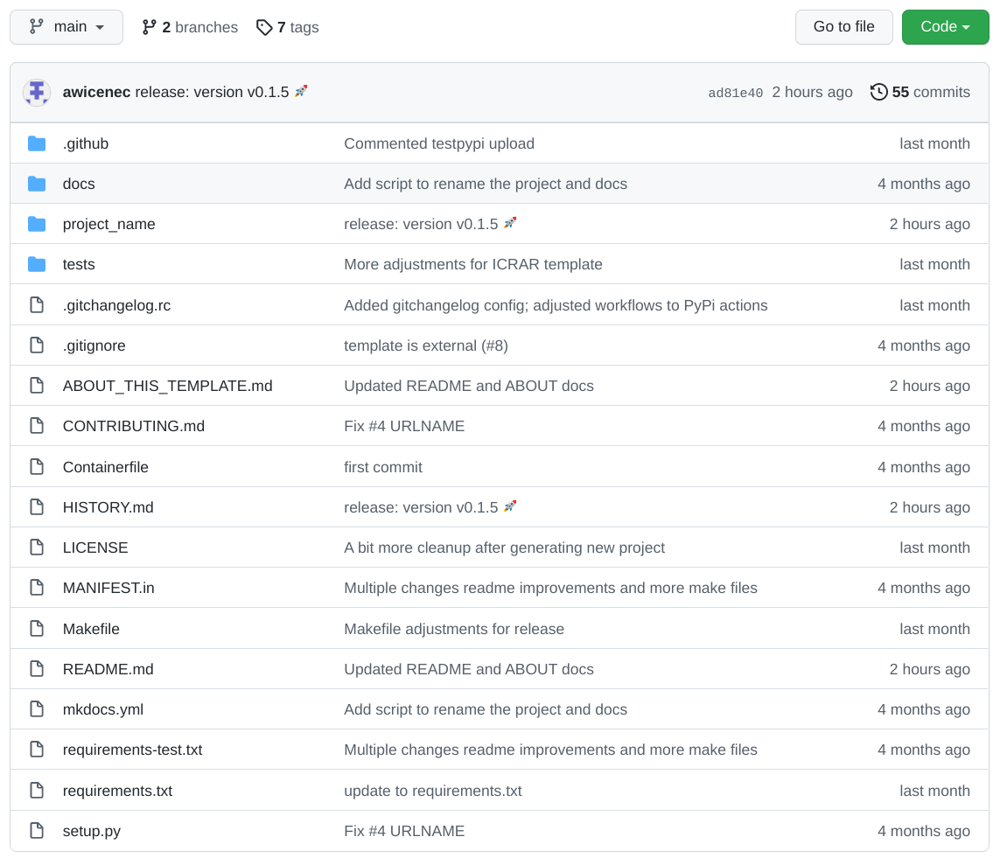
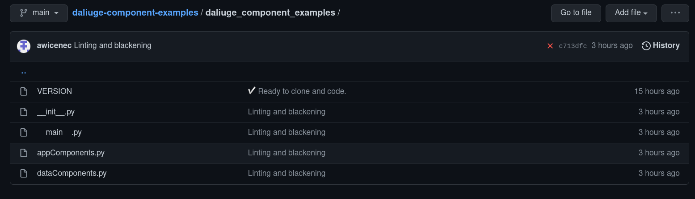

Template Primer
===============
We are providing a GitHUB `component development template <https://github.com/ICRAR/daliuge-component-template>`_. The template covers application and data components and provides everything to get you started, including project setup, testing, format compliance, build, documentation and release, continuous integration and more. Although it is meant to be used to develop a whole set of components, it is quite useful even for just a single one. We are still actively developing the template itself and thus a few things are still missing:

#. Installation into the |daliuge| runtime is possible, but not the way we would like to have it.
#. Automatic palette generation is not yet integrated.

Using the GitHUB template
-------------------------
The `template GitHUB page <https://github.com/ICRAR/daliuge-component-template>`_ contains usage information and the GitHUB documentation contains general information about `template usage <https://docs.github.com/en/repositories/creating-and-managing-repositories/creating-a-repository-from-a-template>`_ as well. Here we provide some additional information about our template in particular. When generating a |daliuge| component project from the template, this will generate a complete GitHUB project structure including code and documentation templates as well as setup release and make scripts. Once cloned, the first thing you should do is execute ``make virtualenv`` to create a sandboxed environment for your component development. You should then execute ``source .venv/bin/activate`` to enter the virtualenv. 

Component project directory structure
-------------------------------------
After using the template and cloning the my_components project you will have a directory structure like the one in the figure below. The ``project_name`` directory will be different, but else this is what you should see.

**In the following we assume the name** ``my_components`` **as an example for the project name!**.

.. _graphs.figs.tmpl_struct:

#. The ``.github`` directory contains the standard GitHUB config and history files, but also some GitHUB action definitions, which will be exectuted by GitHUB whenever your project is pushed. There is one action, which is executed only once, when the new project is created and that will peform some global re-naming and other things, so that you don't have to do that yourself.
#. The ``docs`` directory contains just a stub for your documentation to be provided together with the components.
#. The project_name directory will be renamed to whatever you called your component project at creation time. It is a Python module and thus contains an ``__init__.py`` file.

.. _graphs.figs.tmpl_project_struct:

#. The ``tests`` directory contains the `conftest.py`` file and a ``test_components.py`` file, which contains tests passing with the code stubs in the (renamed!) ``project_name`` directory. 
#. The file ``.gitignore`` contains a whole set of default files to be excluded from a commit.
#. The ``Contributing.md`` file is just a bit a information on how to contribute to the template development.
#. The ``Containerfile`` is a stub for a build file for a container (e.g. docker)
#. The HISTORY.md file is automatically maintained when doing a release.
#. The ``LICENSE`` file contains `The Unlicense` text. Modify as you see fit for your component code. Since the code is not delivered together with the |daliuge| system there is no direct restriction from that side.
#. The MANIFEST.in file just pulls together a number of other files in the same directory.
#. The ``README.md`` file should be modified to reflext your component project.
#. The ``mkdocs.yml`` file is the configuration for the production of the documentation.
#. The ``requirements-test.txt`` file contains a list of all required packages for testing the components. This will be used when executing ``make install``.
#. The ``requirements.txt`` file contains a list of all required packages for testing the components. This will be used when executing ``pip install .``.
#. The file ``setup.py`` is used when installing the component package using pip.
#. 