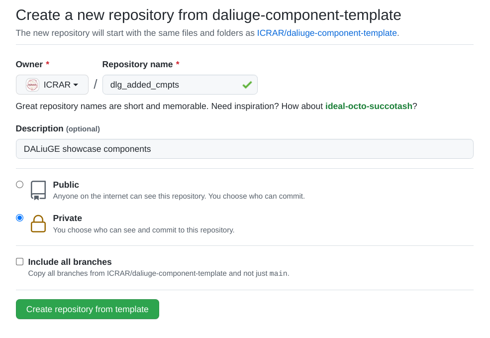
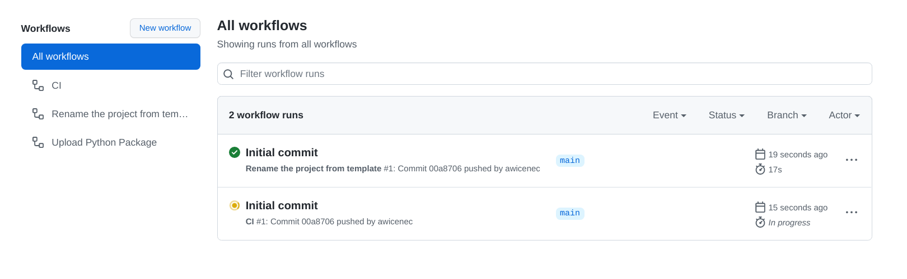
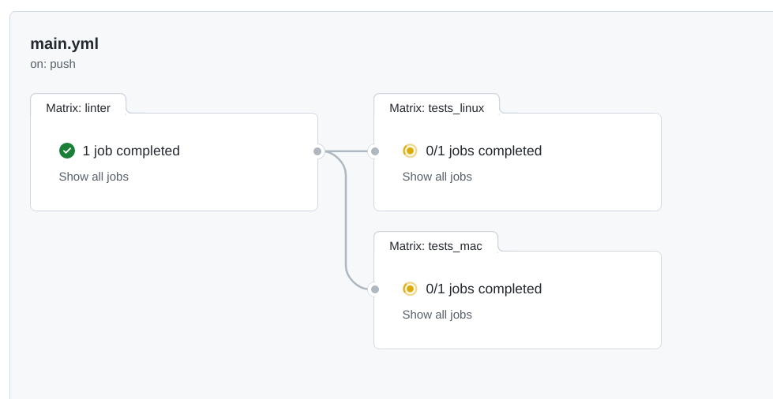
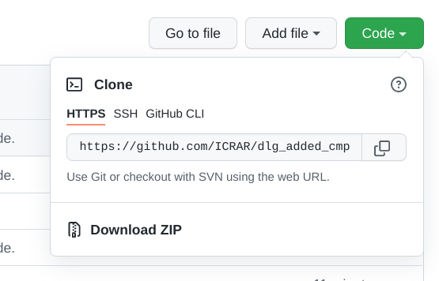
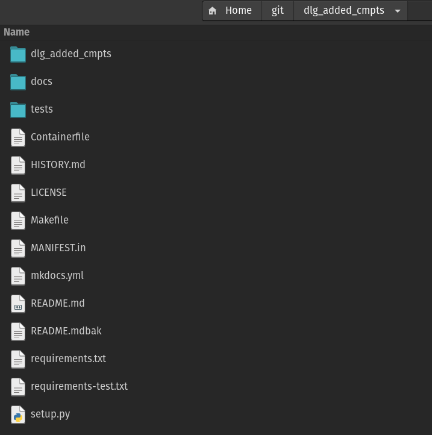

.. _template_primer:

Template Primer
===============
We are providing a GitHUB `component development template <https://github.com/ICRAR/daliuge-component-template>`_. The template covers application and data components and provides everything to get you started, including project setup, testing, format compliance, build, documentation and release, continuous integration and more. Although it is meant to be used to develop a whole set of components, it is quite useful even for just a single one. We are still actively developing the template itself and thus a few things are still missing, or have rough edges.

Using the GitHUB template
-------------------------
First of all, in order to use the template functionality you need to have an account and be logged in to GitHub. The `template GitHUB page <https://github.com/ICRAR/daliuge-component-template>`_ contains usage information and the GitHUB documentation contains general information about `template usage <https://docs.github.com/en/repositories/creating-and-managing-repositories/creating-a-repository-from-a-template>`_ as well. Here we provide some additional information about our template in particular. When generating a |daliuge| component project from the template, this will generate a complete GitHUB project structure including code and documentation templates as well as a Makefile containing targets for testing, liniting, formatting and installation. The creation of the new project is triggering a number of GitHub actions, which need to be finished, *before* cloning the project.

After clicking on the **Use this template** button you will be presented with a screen like the one shown below.

.. _graphs.figs.create_project:

You need to select an owner and enter a repository name. Github will check whether that name is available and put the green tickmark behind the name. You can select to make the repo private or public straight away. Once done, click **Create repository from template**. This will go away and generate a new repository with the owner and name you have specified. It is not quite usable just yet, since there are a number of GitHub actions executed, one of which is going through the files and perform some magic to make the project actually look like yours, rather than just a copy of the template. You can watch the progress by clicking on the **Actions** tab just underneath the project name in the GitHub page. This should look like:

.. _graphs.figs.tmpl_action1:

In addition you can click on one of the running actions and get a bit more detail:

.. _graphs.figs.tmpl_action2:

Once that is all completed the project will be committed again and then it is ready to be cloned to your local machine. Just click on the green **Code** button in the main project page and then on the copy icon next to the URL:

.. _graphs.figs.prj_clone:

Once cloned, please make sure you have a daliuge compatible Python version as your default. Compatible versions are the 3.7 and 3.8 series. Make also sure that you are not already inside a virtualenv. This would very likely screw things up. You should then execute

.. code-block:: none

  make virtualenv
  source .venv/bin/activate
  make install

Component project directory structure
-------------------------------------
After using the template and cloning your new project you will have a directory structure like the one in the figure below. The ``dlg_added_cmpts`` directory will be different, but else this is what you should see.

.. _graphs.figs.tmpl_struct:

#. The ``.github`` directory contains the standard GitHUB config and history files, but also some GitHUB action definitions, which will be exectuted by GitHUB whenever your project is pushed. There is one action, which is executed only once, when the new project is created and that will peform some global re-naming and other things, so that you don't have to do that yourself.
#. The ``docs`` directory contains just a stub for your documentation to be provided together with the components.
#. The project_name directory will be renamed to whatever you called your component project at creation time. It is a Python module and thus contains an ``__init__.py`` file.
#. The ``tests`` directory contains the `conftest.py`` file and a ``test_components.py`` file, which contains tests passing with the code stubs in the (renamed!) ``dlg_added_cmpts`` directory. 
#. The file ``.gitignore`` contains a whole set of default files to be excluded from a commit.
#. The ``Contributing.md`` file is just a bit a information on how to contribute to the template development.
#. The ``Containerfile`` is a stub for a build file for a container (e.g. docker)
#. The HISTORY.md file is automatically maintained when doing a release.
#. The ``LICENSE`` file contains `The Unlicense` text. Modify as you see fit for your component code. Since the code is not delivered together with the |daliuge| system there is no direct restriction from that side.
#. The MANIFEST.in file just pulls together a number of other files in the same directory.
#. The ``README.md`` file should be modified to reflect your component project.
#. The ``mkdocs.yml`` file is the configuration for the production of the documentation.
#. The ``requirements-test.txt`` file contains a list of all required packages for testing the components. This will be used when executing ``make install``.
#. The ``requirements.txt`` file contains a list of all required packages for testing the components. This will be used when executing ``pip install .``.
#. The file ``setup.py`` is used when installing the component package using ``pip install .``.

Now you are all set and can start coding. In the following sections we will describe how to develop a simple component in this environment and how to get your new components into the system.