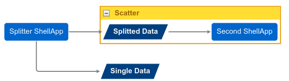
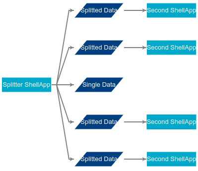

Using the |lge|
###############

.. contents::
   :local:

These are some guidelines
on how to use the |lge|
included in DALiuGE.

General
=======

On the left-hand side is the palette
where different component types are shown.
Users can drag these components and drop them in the central area
where a |lg| will be build up.
When hovering the mouse over a component on the |lg|
different connection points appear on the borders of the component.
By clicking on these
and dragging the mouse over to a different component
users can draw an arrow between two components
signaling a relationship between the two.

By clicking on a component's text
users can also change the label shown by that component
on the |lg|.
This is useful for readability
and has no impact on the final output of the |lg|.

Also when clicking on a component
the editor will show the component's properties
on the bottom-right corner.
Users can change here some values associated to the components.
Different components support different properties.

Components
==========

ShellApp
--------

The |shell| component represents a ``bash`` shell command.
The command to be run is written using
its different ``Arg`` properties.
For example, to run ``echo 123``
users would have to write ``echo`` in ``Arg01``
and ``123`` in ``Arg02``.

When referring to the application's inputs and outputs
in the command line
``%i[X]`` and ``%o[X]`` can be used, respectively,
where ``X`` refers to the ``key`` property
of the referenced input/output.
These placeholders will eventually be replaced
with the file path of the corresponding inputs or outputs
when executing the command.
For inputs and outputs that are not filesystem-based
the ``%iDataURL[X]`` and ``%oDataURL[X]`` placeholders
can be used instead.

Note that sometimes an application is connected
to an input or output component
representing more than one physical input or output
(e.g., an application outside a |scatter| component
connected to a |data| component inside the |scatter|).
In these cases the corresponding placeholder will expand
to a semicolon-delimited list of paths or URLs.
It will be the responsibility of the application
to deal with these cases.

Data
----

The |data| component represents a payload.
When transitioning from the |lg| to the |pg|
these components generate ``InMemory`` drops currently,
but support will be added in the future
to generate drops with different storage mechanisms.

Scatter
-------

The |scatter| component represents parallel branches of execution.
Is is represented by a yellow-bordered box
that allows other components to be placed within.
All the contents of the body of a |scatter|
will be replicated as parallel branches of execution
when performing the |lg| to |pg| transition
depending on the value of its ``num_of_copies`` property.

Components *outside* a |scatter|
can be connected to components *inside* the |scatter|.
In such cases, when he Physical Graph is generated,
the *outside* component will appear as connected
to the many copies generated from *inside* the |scatter|.

Examples
========

Simple scatter
--------------

In this example we will have an application
producing many outputs, identical in nature,
which are then processed in parallel by a second application.
The initial application also outputs a different, single file.

To do this we drop a |shell| into the |lg|.
Next to it we drop a |scatter| component.
Inside the |scatter| component we drop a |data| component,
and next to the |data| component we finally drop
a second |shell| component.
One can then draw an arrow
from the first |shell| to the |data| component,
and a second one
from the |data| component to the second |shell|.
Finally, drop a |data| component outside the |scatter|
and draw an arrow from the first |shell| component into it.
Optionally change the names of the components
for readability.

The final result should look like this:

If you save the |lg| form above,
and then generate the |pg|
it will look like this:

Here it can be clearly seen
how the |scatter| component's body
has been replicated according to its configuration.
It also shows how the first application
now produces multiple outputs.

.. |lg| replace:: Logical Graph
.. |lge| replace:: Logical Graph Editor
.. |pg| replace:: Physical Graph
.. |shell| replace:: ``ShellApp``
.. |data| replace:: ``Data``
.. |scatter| replace:: ``Scatter``
