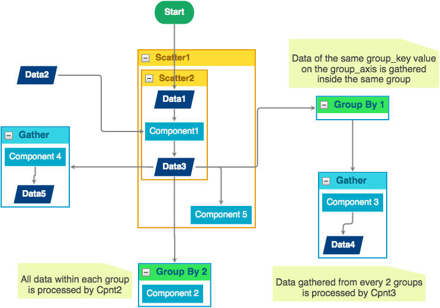

Graphs
------

A processing pipeline or workflow in |daliuge| is described by a Directed Graph where the nodes
denote both task (application components) and data (data components). The edges denote
execution dependencies between components. Section :ref:`dlg_functions` has briefly
introduced graph-based functions in |daliuge|. This section provides implementation
details in |daliuge|.

Logical Graph
^^^^^^^^^^^^^

A |lg| is a compact representation of the logical operations and data flow in a processing
pipeline without being concerned about the underlying hardware resources. There are a number of different application and data components available to design logical graphs. In addition to simple components |daliuge| also supports a number of complex components to support the encoding of higher level language constructs like loop, scatter, gather and group-by. In particular the scatter component allows users to encode possible paralellisation of operations and whole sections of the graph. It should be noted though, whether those parts are really executed in parallel or serial depends on the actual deployment and availability of resources capable of the desired parallelism.  Such complex components are also referred to as a *construct* in a |lg|. 

.. _graphs.figs.scatter:

   An example of a |lg| with data components (e.g. Data1 - Data5),
   application components (i.e. Component1 - Component5), and control flow complex components (constructs)
   (Scatter, Gather, and Group-By). This example can be viewed
   `online <http://sdp-dfms.ddns.net/lg_editor?lg_name=lofar_cal.json>`_ in the |daliuge| prototype.

Construct properties
""""""""""""""""""""
Each construct has several
associated properties that users have control over during the development of a
|lg|.
For Component and Data constructs the **Execution time** and **Data volume** are two very important
properties. Such properties can be directly obtained from parametric models or
`estimated <http://ieeexplore.ieee.org/xpl/login.jsp?tp=&arnumber=546196>`_ from the profiling information (e.g. pipeline component workload characterisation) and COMP platform specification.

Control flow constructs
"""""""""""""""""""""""
Control flow constructs form the "skeleton" of the |lg|, and determine
the final structure of the |pg| to be generated. |daliuge| currently supports
the following flow constructs:

* **Scatter** indicates data parallelism. Constructs inside a *Scatter* construct
  represent a group of components consuming a single data partition within the enclosing
  *Scatter*. A useful property of *Scatter* is ``num_of_copies``.
  In the example in :numref:`graphs.figs.scatter`, if the ``num_of_copies`` for
  ``Scatter1``
  and ``Scatter2`` are 5 and 4 respectively, the generated |pg|
  will have in total 20 ``Data1``/``Component1``/``Data3`` Drops, but only 5 Drops for the
  construct ``Component 5``,
  which is inside the ``Scatter1`` construct but outside ``Scatter2``.

* **Gather** indicates data barriers. Constructs inside a *Gather* represent a group
  of components consuming a sequence of data partitions as a whole. *Gather* has a
  ``num_of_inputs`` property,
  which represents the *Gather* "width", stating how many
  partitions each *Gather* instance (translated into a ``BarrierAppDROP``, see
  :ref:`drop.component.iface`)
  can handle. This in turn is used by |daliuge| to determine how many *Gather* instances should be
  generated in the |pg|. *Gather* sometimes can be used in conjunction with
  *Group By* (see middle-right in :numref:`graphs.figs.scatter`), in which case, data held in a sequence of groups are processed
  together by components enclosed by *Gather*.

* **Group By** indicates data resorting (e.g. `corner turning <https://mnras.oxfordjournals.org/content/410/3/2075.full>`_ in radio astronomy).
  The semantic is analogous to the ``GROUP BY`` construct used in SQL statement for relational
  databases, but applied to data Drops. The current |daliuge| prototype requires that
  *Group By* is used in
  conjunction with a nested *Scatter* such that data Drops that are originally sorted
  in the order of ``[outer_partition_id][inner_partition_id]`` are resorted as ``[inner_partition_id][outer_partition_id]``.
  In terms of parallelism, *Group By*
  is comparable to the `"static" MapReduce <http://openmymind.net/2011/1/20/Understanding-Map-Reduce/>`_,
  where the keys used by all Reducers are known a priori.

* **Loop** indicates iterations. Constructs inside a *Loop* represent a group of
  components and data that will be repeatedly executed / produced for a fixed number of
  times. Given the basic DROP principle of "writing once, read many times", the current
  |daliuge| prototype does not support dynamic branch condition for *Loop*.
  Instead, each *Loop* construct has a property named ``num_of_iterations`` that must be
  determined at |lg| development time, and that determines the number of
  times the loop is "unrolled". In other words, a
  ``num_of_iterations``
  number of Drops for each construct inside a *Loop* will be statically generated
  in the |pg|. An example is shown in :numref:`graphs.figs.loop`.

  .. _graphs.figs.loop:

  .. figure:: images/loop_example.png

     A nested-Loop (minor and major cycle) example of |lg| for
     a continuous imaging pipeline. This example can be `viewed online <http://sdp-dfms.ddns.net/lg_editor?lg_name=cont_img.json>`_ in the |daliuge| prototype.

Repository
""""""""""
The |daliuge| prototype uses a Web-based |lg| editor as the default user interface
to the underlying *logical graph repository*, which currently is simply a managed
POSIX file system directory. Each |lg| is physically stored as a
JSON-formatted textual file, and can be accessed and modified remotely through
the |lg| editor via the RESTful interface. For example, the JSON file for the continuous
imaging pipeline as shown partially in :numref:`graphs.figs.loop` can be accessed `through HTTP GET <http://sdp-dfms.ddns.net/jsonbody?lg_name=cont_img.json>`_.
The editor also provides a Web-based JSON editor so that users can directly change
the graph JSON content inside the repository.

Select template
"""""""""""""""
While the |daliuge| |lg| editor does not differentiate between |lg|
and *logical graph template*, users can create either of them using the editor
(after all,
the only differences between these two are the populated values for some
parameters).
Once a template is created or selected, users can simply copy and paste the JSON content into
the new |lg| and fill in those parameter values (as construct properties)
using the editor. Note that the public version of the |lg| editor has
not yet opened its "create new logical graph" API.

.. _graphs.translation:

Translation
^^^^^^^^^^^
While a |lg| provides a compact way to express complex processing logic,
it contains high level control flow specifications that are not directly usable
by the underlying graph execution engine and DROP managers. To achieve that,
logical graphs are translated into physical graphs. The translation process essentially
creates all Drops and is implemented in the :doc:`api/dropmake` module.

Basic steps
"""""""""""
**DropMake** in the |daliuge| prototype involves the following steps:

* **Validity checking**. Checks whether the |lg| is ready to be translated.
  This step is similar to semantic error checking used in compilers.
  For example, |daliuge| currently does not allow any cycles in the |lg|. Another
  example is that *Gather* can be placed only after a *Group By* or a *Data* construct
  as shown in :numref:`graphs.figs.scatter`. Any validity errors
  will be displayed as exceptions on the |lg| editor.

* **Construct unrolling**. Unrolls the |lg| by (1) creating all necessary Drops
  (including "artifact" Drops that do not appear in the original |lg|),
  and (2) establishing directed edges amongst all newly generated Drops. This step
  produces the **Physical Graph Template**.

* **Graph partitioning**. Decomposes the *Physical Graph Template* into a set of
  logical partitions (a.k.a. *DropIsland*) and generates an order of DROP
  execution sequence within each partition such that certain performance
  requirements (e.g. total completion time, total data movement, etc.) are met
  under given constraints (e.g. resource footprint). An important assumption is
  that the cost of moving data within the same partition is far
  less than that between two different partitions. This step produces
  the **Physical Graph Template Partition**.

* **Resource mapping**. Maps each logical partition onto a given set of resources
  in certain optimal ways (load balancing, etc.). Concretely, each DROP is assigned
  a physical resource id (such as IP address, hostname, etc.). This step requires
  near real-time resource usage information from the COMP platform or the Local Monitor & Control (LMC).
  It also needs DROP managers to coordinate the DROP deployment.
  In some cases, this mapping step is merged with the previous *Graph partitioning* step
  to directly map Drops to resources. This step produces the **Physical Graph**.

Under the assumption of uniform resources (e.g. each node has identical capabilities),
graph partitioning is equivalent to resource mapping since mapping involves simple
round-robin all available resources. In this case, graph partitioning
algorithms (e.g. METIS [5]) actually support multi-constraints
load balancing so that both CPU load and memory usage on each node is roughly similar.

For heterogeneous resources, which |daliuge| has not yet supported, usually the graph
partitioning is first performed, and then resource mapping refers to the assignment
of partitions to different resources based on demands and capabilities using
graph / `tree-matching algorithms[16] <http://ieeexplore.ieee.org/xpl/login.jsp?tp=&arnumber=6495451>`_ .
However, it is also possible that the graph partitioning
algorithm directly produces a set of unbalanced partitions “tailored” for those
available heterogeneous resources.

In the following context, we use the term **Scheduling** to refer to the combination of
both *Graph partitioning* and *Resource mapping*.

Algorithms
""""""""""
Scheduling an Acyclic Directed Graph (DAG) that involves graph partitioning and resource mapping as stated in `Basic steps`_
is known to be an `NP-hard problem <http://ieeexplore.ieee.org/xpls/abs_all.jsp?arnumber=210815>`_.
The |daliuge| prototype has tailored several heuristics-based algorithms from previous research on `DAG scheduling <http://dl.acm.org/citation.cfm?id=344618>`_
and `graph partitioning <http://www.sciencedirect.com/science/article/pii/S0743731597914040>`_ to perform these two steps. These algorithms are currently configured by |daliuge| to utilise uniform hardware resources.
Support for heterogenous resources using the `List scheduling <https://en.wikipedia.org/wiki/List_scheduling>`_
algorithm will be made available shortly. With these algorithms, the |daliuge| prototype
currently attempts to address the following translation problems:

* **Minimise the total cost of data movement** but subject to a given **degree of load balancing**.
  In this problem, a number `N` of available resource units (e.g. a number of compute nodes)
  are given, the translation process aims to produce `M` DropIslands (`M <= N`)
  from the *physical graph template* such that (1) the total volume of data traveling
  between two distinct DropIslands is minimised, and (2) the workload variations
  measured in aggregated **execution time** (DROP property) between a pair of DropIslands is less than a given
  percentage `p` %. To solve this problem, graph partitioning and resource mapping steps are merged into one.

* **Minimise the total completion time** but subject to a given **degree of parallelism** (DoP)
  (e.g. number of cores per node) that each DropIsland is allowed to take advantage of.
  In the first version of this problem, no information regarding resources is given.
  |daliuge| simply strives to come up with the optimal number of DropIslands such that
  (1) the total completion time of the pipeline (which depends on both execution time
  and the cost of data movement on the graph critical path) is minimised, and (2)
  the maximum degree of parallelism within each DropIsland is
  never greater than the given *DoP*. In the second version of this problem,
  a number of resources of identical performance capability are also given in addition
  to the *DoP*. This practical problem is a natural extension of version 1,
  and is solved in |daliuge| by using the
  `"two-phase" method <http://ieeexplore.ieee.org/xpls/abs_all.jsp?arnumber=580873>`_.

* **Minimise the number of DropIslands** but subject to (1) a given **completion time deadline**,
  and (2) a given *DoP* (e.g. number of cores per node)
  that each DropIsland is allowed to take advantage of. In this problem, both completion
  time and resource footprint become the minimisation goals. The motivation of this problem
  is clear. In an scenario where two different schedules can complete the processing pipeline
  within, say, 5 minutes, the schedule that consumes less resources is preferred. Since a DropIsland
  is mapped onto resources, and its capacity is already constrained by a given DoP,
  the number of DropIslands is proportional to the amount of resources needed.
  Consequently, schedules that require less number of DropIslands are superior.
  Inspired by the `hardware/software co-design <http://ieeexplore.ieee.org/xpls/abs_all.jsp?arnumber=558708>`_ method in embedded systems design,
  |daliuge| uses a "look-ahead" strategy at each optimisation step to adaptively
  choose from two conflicting objective functions (deadline or resource) for
  local optimisation, which is more likely to lead to the global optimum than
  greedy strategies.

Physical Graph
^^^^^^^^^^^^^^

The `Translation`_ process produces the *physical graph specification*, which, once
deployed and instantiated "live", becomes the |pg|, a
collection of inter-connected Drops in a distributed
execution plan across multiple resource units. The nodes of a |pg| are
Drops representing either data or applications. The two DROP nodes connected by
an edge always have different types from each other. This establishes a set of
reciprocal relationships between Drops:

* A data DROP is the *input* of an application DROP; on the other hand
  the application is a *consumer* of the data DROP.
* Likewise, a data DROP can be a *streaming input* of an application
  DROP (see :ref:`drop.relationships`) in which case the application is seen as
  a *streaming consumer* from the data DROP's point of view.
* Finally, a data DROP can be the *output* of an application DROP, in
  which case the application is the *producer* of the data DROP.

Physical graph specifications are the final (and only) graph products that will be submitted
to the :ref:`drop.managers`. Once DROP managers accept a |pg| specification,
it is their responsibility to create and deploy DROP instances on their managed resources as
prescribed in the |pg| specification such as partitioning information
(produced during the `Translation`_) that allows different managers to distribute
graph partitions (i.e. DropIslands) across different nodes and Data Islands by
setting up proper :ref:`drop.channels`. The fact that physical graphs are made
of Drops means that they describe exactly what an :ref:`graph.execution` consists
of. In this sense, the |pg| is the graph execution engine.

In addition to DROP managers, the |daliuge| prototype also includes a *Physical Graph Manager*,
which allows users to manage all currently running and past physical graphs within
the system. Although the current *Physical Graph Manager* implementation only supports
to "add" and "get" |pg| specifications, features such as graph event monitoring
(through the DROP :ref:`drop.events` subscription mechanism) and the graph statistics dashboard will
be added in the near future.

.. _graph.execution:

Execution
^^^^^^^^^

A |pg| has the ability to advance its own
execution. This is internally implemented via the DROP event mechanism as follows:

* Once a data DROP moves to the COMPLETED state it will fire an event
  to all its consumers. Consumers (applications) will then deem if they can start their
  execution depending on their nature and configuration. A specific type of
  application is the ``BarrierAppDROP``, which waits until all its inputs are in
  the **COMPLETED** state to start its execution.
* On the other hand, data Drops receive an even every time their producers
  finish their execution. Once all the producers of a DROP have finished, the
  DROP moves itself to the **COMPLETED** state, notifying its consumers, and so
  on.

Failures on applications and data Drops are transmitted likewise automatically
via events. Data Drops move to **ERROR** if any of its producers move to
**ERROR**, and application Drops move the **ERROR** if a given input error
threshold (defaults to 0) is passed (i.e., when more than a given percentage of
inputs move to **ERROR**) or if their execution fails. This way whole branches of execution might fail, but
after reaching a gathering point the execution might still resume if enough
inputs are present.

.. |lg| replace:: logical graph
.. |pg| replace:: physical graph
