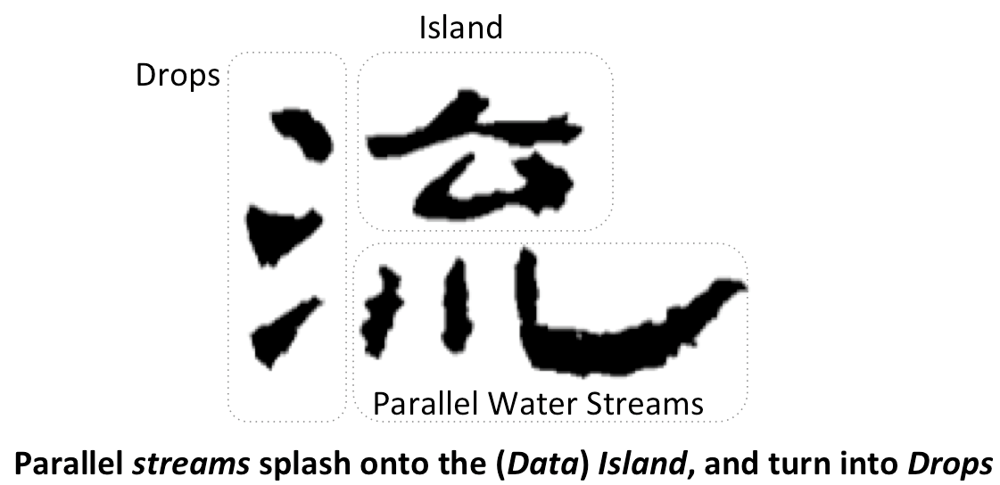

.. daliuge documentation master file, created by
   sphinx-quickstart on Mon Feb  8 16:19:47 2016.
   You can adapt this file completely to your liking, but it should at least
   contain the root `toctree` directive.

|daliuge|
#########

Welcome to the Data Activated 流 [#f1]_ Graph Engine (|daliuge|).

|daliuge|
is a workflow graph execution framework, specifically designed to support very large scale processing graphs for the reduction of interferometric radio astronomy data sets. DALiuGE has already been used for processing large astronomical datasets in existing radio astronomy projects. It originated from a prototyping activity as part of the SDP Consortium called Data Flow Management System (DFMS). DFMS aimed to prototype the execution framework of the proposed SDP architecture.
For a complete tour of |daliuge| please read
our `overview paper <http://dx.doi.org/10.1016/j.ascom.2017.03.007>`_. DALiuGE has been used in a project running a `full-scale simulation <http://dx.doi.org/10.1109/SC41405.2020.00006>`_ of the Square Kilometre Array dataflow on the ORNL Summit supercomputer.

Development and maintenance of |daliuge| is currently hosted at ICRAR_
and is performed by the `DIA team <http://www.icrar.org/our-research/data-intensive-astronomy/>`_.

.. toctree::
 :maxdepth: 2

 intro
 basics
 installing
 usage/index
 architecture/index
 graph_development
 eagle
 development/dev_index
 api-index
 deployment

Should you have any questions, please contact us at: dfms_prototype AT googlegroups DOT com

Citations
---------
As you use |daliuge| for your exciting projects, please cite the following paper:

`Wu, C., Tobar, R., Vinsen, K., Wicenec, A., Pallot, D., Lao, B., Wang, R.,
An, T., Boulton, M., Cooper, I. and Dodson, R., 2017.
DALiuGE: A Graph Execution Framework for Harnessing the Astronomical Data Deluge.
Astronomy and Computing, 20, pp.1-15. (2017) <https://arxiv.org/pdf/1702.07617.pdf>`_

.. _ICRAR: http://www.icrar.org
.. [#f1] 流 (pronounced Liu) is the Chinese character for "flow".
