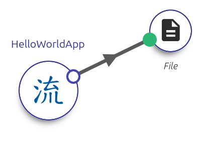
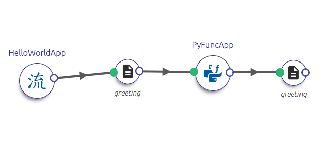

.. _more_complex:

More complex workflows
======================

In this section, we'll build on our basic understanding of DALiuGE workflows by adding more complexity and real-world functionality. We'll explore how to manipulate data, combine different types of applications, and work with various data formats.

Our goals are to:

* Extend our simple workflow with more sophisticated data processing
* Learn how to handle different types of data
* Create custom Python functions to transform data
* Understand DALiuGE's data management capabilities

We'll accomplish this by:

1. Building on our Hello World example
2. Learning how to manage data movement between components
3. Creating custom Python applications
4. Working with real astronomical data and common file formats

Reviewing Hello, World
----------------------

Let's drill into the Hello, World example we've run previously, by loading up the HelloWorld-Simple graph (below):

If you run the workflow with no changes as before, the output file will have a DALiuGE-defined name and it will be placed in the session workspace directory. This default behaviour is intentional, because it lets DALiuGE guarantee that outputs are tracked consistently and stored in a predictable place without you needing to manually manage filenames. This is an example of a core element of DALiuGE’s dataflow model:

    > DALiuGE is responsibile for reading and writing data, 'allowing' workflow components focus on what they produce

You can then experiment with copying or renaming the output to make this behaviour more visible. For example, we can also specify a relative filepath if we have a particular name we want to use:

    - Click on the ``File`` drop
    - Update the value of the ``filepath`` parameter to ``myfile.txt``

      .. image:: ../images/workflows/hello_world_basic_fileattr.png

    - Re-run the graph and check the newest session directory:: 
        
        cd ~/dlg/workspace
        ls -ltr # The bottom result gives you the most recent 
        cd  HelloWorld-simpleXX-XXXX-XX-XXXX-XX-XX.XXXX
        cat myfile.txt

        Hello, DALiuGE

If you want the output to be stored outside the session directory, you can use an absolute path (including environment variables) such as $HOME or $DATA (if defined on the path).

    - Update the value of the ``filepath`` parameter to ``$HOME/data/myfile.txt``
    - Re-run the graph and check the ``$HOME/data/`` directory to confirm ``myfile.txt`` is present. 

This is particularly helpful for *input* data, which may be stored in a read-only space or a `/scratch/` environment.

To recap some invisible but important points here:

    - The default, and encouraged, DALiuGE behaviour is to be in control of both data read and write, as well as being in control of output file naming:
    - With DALiuGE controlling naming and provenance, individual applications don’t need complicated coordination logic to avoid collisions or track which file belongs to which run.
    - Everything takes place within the *session directory*, meaning that data is localised to a session. This supports reproducibility and improves the isolation of the workflow.

Extending Hello, World
----------------------

Let's explore how we can extend Hello, World, and show off some more of how DALiUGE manages data 

We will add a new app to the graph that takes the output of Hello, World and reverses the string. 

This contains the following code in the PyFuncApp to reverse anything in the File drop::

    def reverse(greeting: str): 
	    return greeting[-1::-1]

Adding this and another output file.

Using other encodings, and getting more complex
------------------------------------------------

We've spent some time with the basic Hello, World example; let's move on to with some real astronomical data processing!

In this example,  we'll create a workflow that demonstrates how to:

* Load and process NumPy array data
* Perform basic signal processing
* Verify the output of the data

For this example, we'll work with a synthetic noisy signal that might represent an astronomical observation. We'll use the NumPy library (which will be installed in your DALiuGE virtual environment).

We have some array data that represents a noisy signal (:download:`noisy_signal.npy <../data/noisy_signal.npy>`). Assuming we've downloaded this in a folder like $HOME/data/, lets use ``numpy`` to view the image first to see what we are dealing with::

    > import numpy as np
    > import matplotlib.pyplot as plt
    > data = np.load("$HOME/data/noisy_signal.npy")
    > plt.figure(figsize=(10,6))
    > plt.imshow(data, cmap='viridis')
    > plt.colorbar()
    > plt.title("Noisy Signal")
    > plt.show()

Let's create a workflow that will:
1. Load this noisy data
2. Apply a simple smoothing filter
3. Save both the filtered result and a mask showing where significant signal was detected

DALiuGE can load this

- Show how we can produce files and switch to memory and back for testing
- Show how we can write without explicitly using a 'writer'

The files produced by this will be in the workspace folder: 

- Check the mask 
- Check the final signal, and we can see there's alternative 

* DALiuGE can handle NumPy arrays natively through memory
* For some specialized formats (FITS, HDF5), you may need to use file-based interfaces
* Consider memory usage when working with large arrays

Conclusions
------------

In this tutorial, we've learned:

* How to extend basic workflows with data processing capabilities
* Different ways to manage data movement in DALiuGE
* How to work with both simple text and binary data formats
* Best practices for handling scientific data in workflows

These concepts form the foundation for building more complex scientific workflows. We've seen how DALiuGE can handle both simple string operations and real numerical data processing, making it suitable for a wide range of scientific computing tasks.

Next
----

In the following sections, we will:

* Take a deeper dive into DALiuGE's data management capabilities
* Learn about best practices for data handling in complex workflows
* Explore how to use the Component Palette to generate template functions
* Build more sophisticated astronomical data processing pipelines

These topics will help you create more efficient and maintainable workflows for your specific use cases.
  
